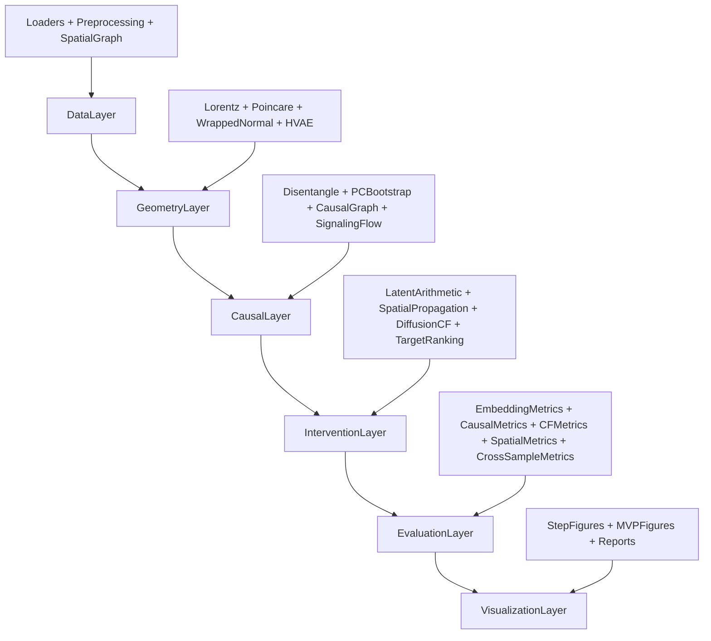

# HyperSCA

HyperSCA (Hyperbolic Spatiotemporal Causal Analysis) 是一个面向结直肠癌免疫微环境研究的计算框架。该框架集成双曲几何嵌入、因果图发现和反事实扰动分析，支持 scRNA-seq、空间转录组和临床分层数据的联合分析，用于机制推断与可干预靶点评估。

## Project and Algorithm Overview

HyperSCA 的流程由三个核心阶段和一个整合流程组成：

- Stage 1（Embedding）：在 Lorentz/Poincare 双曲流形上学习细胞状态表示。
- Stage 2（Causal）：在去缠结潜变量上执行因果结构发现与信号流推断。
- Stage 3（Counterfactual）：在潜空间做基因扰动并模拟空间传播，完成靶点排序。
- MVP Integration（Result-level）：整合 `scCRC_Neu + scCRC_IFNG + ST_CRC_MSS`，支持 Hyperbolic/Euclidean 双模式比较与 MSI/MMR 分层。

## Pipeline Flowchart



## Architecture Overview Diagram



## Core Algorithms

### 1) Hyperbolic Embedding

- 关键模块：`src/models/hyperbolic/lorentz.py`, `src/models/hyperbolic/poincare.py`, `src/models/hyperbolic/wrapped_normal.py`, `src/models/hyperbolic/hvae.py`
- 目的：在双曲空间中更好地保持细胞层级结构与远近关系，降低欧氏空间下的几何失真。

### 2) Causal Discovery and Signaling Flow

- 关键模块：`src/causal/disentangle.py`, `src/causal/cmi_pruning.py`, `src/causal/causal_graph.py`, `src/causal/signaling_flow.py`
- 方法要点：`z_int/z_ext` 去缠结 + PC 条件独立检验 + bootstrap 稳定性 + DoWhy 结构验证 + L-R-TF-Target 多层流。

### 3) Counterfactual Perturbation and Spatial Propagation

- 关键模块：`src/perturbation/latent_arithmetic.py`, `src/perturbation/spatial_propagation.py`, `src/perturbation/diffusion_cf.py`, `src/perturbation/target_ranking.py`
- 方法要点：潜空间虚拟敲除、因果图约束扩散、空间梯度衰减拟合、靶点可干预性排序。

### 4) Niche and Cross-sample Stratification

- 关键模块：`src/evaluation/cross_sample_metrics.py`
- 方法要点：生态位聚类（niche clustering）、跨样本边一致性、MMR 分层差异检验，纳入最终证据矩阵。

## Example Data Samples

项目常用示例输入（路径为本地外部数据目录，不纳入版本控制）：

- `G:/scCRC_Neu`  
  - 代表文件：`*-NormalizedCounts.tsv`, `*-DESeq2_result.tsv`
  - 用途：构建 cluster-level 表达矩阵、差异基因候选池。
- `F:/scCRC_IFNG`  
  - 代表文件：`results/tables/sample_clinical_mapping.csv`, `targets_shared_specific_by_mmr.csv`, `niche_shared_specific_by_mmr.csv`
  - 用途：MSI/MMR 分层、IFNG 相关靶点补充、跨样本生态位分析。
- `G:/ST_CRC_MSS`  
  - 代表文件：`STmetadata_*.csv`
  - 用途：空间反卷积、细胞共定位邻接、传播梯度评估。

统一标准化输出（示例）：

- `results/integration/schema/sample_table.csv`
- `results/integration/schema/entity_table.csv`
- `results/integration/schema/feature_table.csv`
- `results/integration/schema/measure_table.csv`

## Installation Guide

### 1) Create Conda Environment

```bash
conda create -n hypersca python=3.10 -y
conda activate hypersca
```

### 2) Install Dependencies

```bash
pip install -r requirements.txt
```

CUDA 12.4 推荐安装：

```bash
pip install torch torchvision torchaudio --index-url https://download.pytorch.org/whl/cu124
pip install torch-geometric -f https://data.pyg.org/whl/torch-2.6.0+cu124.html
```

### 3) Validate Runtime Environment

```bash
python scripts/validate_env.py
```

## Quick Start

### A. Build Canonical Schema

```bash
python scripts/build_canonical_schema.py
```

### B. Run Multi-source MVP (Hyperbolic + Euclidean)

```bash
python scripts/run_mvp_integration.py --embedding-mode both --max-targets 10
```

### C. Run Open Target Discovery

```bash
python scripts/run_target_discovery.py
```

### D. Generate CNS-style Figures

```bash
python scripts/generate_mvp_figures.py
```

## Key Outputs

- Integration schema: `results/integration/schema/`
- MVP mode-wise outputs:  
  - `results/integration/mvp/hyperbolic/`
  - `results/integration/mvp/euclidean/`
- Figure pack: `results/figures/integration/`
- Discovery reports: `results/integration/discovery/`

## Testing

```bash
pytest tests/ -v
```

## Notes for Code Update and Upload

- 请勿提交 `data/`, `results/`, `references/` 等大文件目录（已在 `.gitignore`）。
- 推荐提交范围：`src/`, `scripts/`, `docs/`, `README.md`, `tests/`。
- 建议参考 `docs/repository_structure.md` 维护必要源代码与示例脚本的仓库边界。
- 若需论文复现，建议在 release 或 docs 中补充固定版本号和参数快照。

## License

MIT License.
