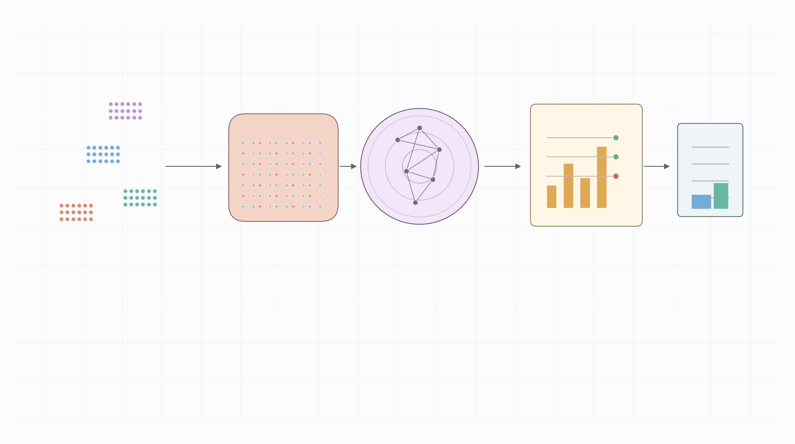
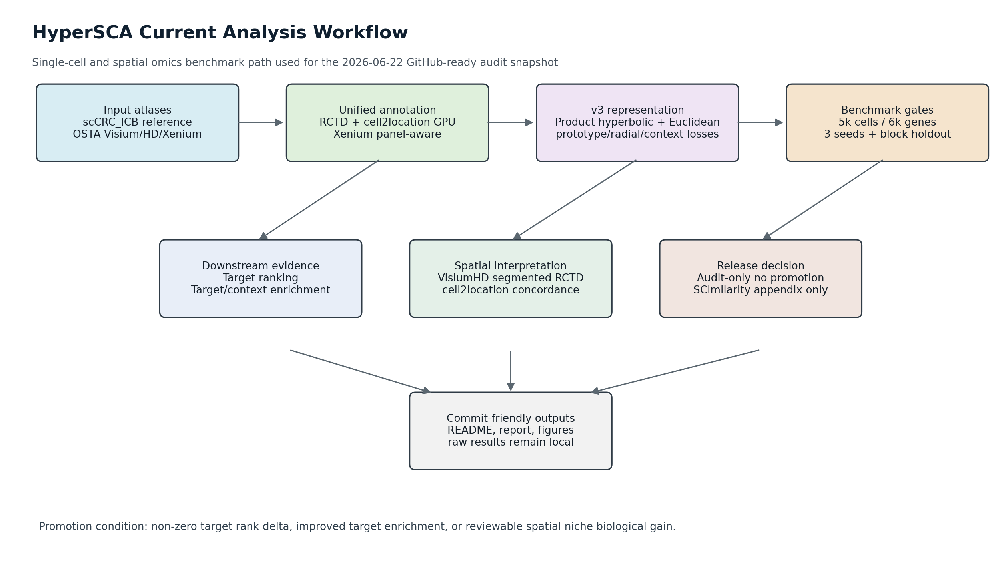

<p align="center">
  
</p>

# HyperSCA

HyperSCA (Hyperbolic Spatiotemporal Causal Analysis) is a Python/R research pipeline for integrating single-cell RNA-seq, spatial transcriptomics, hyperbolic representation learning, causal inference, perturbation analysis, and target discovery. The current development focus is colorectal cancer spatial-immune benchmarking with unified cell annotation and spatial niche interpretation.





## Current Benchmark Snapshot

The 2026-06-22 benchmark update keeps the active target ranking unchanged and evaluates only two internally trained v3 hyperbolic-spatial candidates in the main comparison:

- `hvae_hierarchy_spatial_v3_product`
- `hvae_hierarchy_spatial_v3_product__without_radial_depth_loss`

SCimilarity is kept as an external pretrained appendix reference, not a main competitor. Both v3 candidates remain `audit_only_no_promotion`: target rank delta is still zero, target enrichment does not improve, and prototype/radial hierarchy supervision remains near chance. VisiumHD full cell2location passed the expected 545,913-row abundance check, and RCTD/cell2location dominant grid concordance is 0.827.

Primary summary artifacts:

- Progress report: `docs/research/hypersca_benchmark_progress_20260622.md`
- Reproducible snapshot: `docs/research/hypersca_benchmark_progress_20260622.json`
- Local progress inventory: `docs/research/hypersca_project_progress_inventory_20260622.md`
- Two-candidate figure: `docs/research/figures/hypersca_two_candidate_downstream_summary_20260622.png`
- GitHub submission notes: `docs/github_submission_20260622.md`

## Project Structure

| Path | Purpose |
| --- | --- |
| `src/` | Reusable Python packages for models, causal inference, perturbation, discovery, evaluation, and data handling. |
| `src/models/hyperbolic/` | Lorentz/Poincare geometry, HVAE components, hierarchy losses, and hyperbolic utilities. |
| `src/discovery/target_discovery/` | Modular target discovery pipeline, scoring, spatial context, guardrails, and benchmark helpers. |
| `scripts/` | CLI entrypoints for data onboarding, spatial annotation, benchmark generation, reports, and figures. |
| `tests/` | Pytest suites mirroring the main packages and benchmark scripts. |
| `docs/` | GitHub-friendly documentation, figures, reports, and project inventories. |
| `reports/` | Local methodology notes and compact review artifacts. |
| `results/` | Large generated benchmark outputs; intentionally ignored by Git. |

## Installation

Create the main environment:

```bash
conda create -n hypersca python=3.10 -y
conda activate hypersca
pip install -r requirements.txt
```

For GPU workloads, install a CUDA-compatible PyTorch build before running full cell2location or v3 HVAE jobs. Confirm GPU visibility:

```bash
python - <<'PY'
import torch
print(torch.cuda.is_available(), torch.cuda.get_device_name(0) if torch.cuda.is_available() else "cpu")
PY
```

Validate the runtime:

```bash
python scripts/validate_env.py
```

## Development Commands

Run the full test suite:

```bash
PYTHONPATH=. pytest tests -q -p no:cacheprovider
```

Run focused discovery tests:

```bash
PYTHONPATH=. pytest tests/discovery -q -p no:cacheprovider
```

Run a small target-discovery demo:

```bash
python scripts/run_target_discovery.py \
  --run-id demo_target_discovery \
  --max-perturb 10 \
  --skip-figures
```

Regenerate the current benchmark documentation from local artifacts:

```bash
python scripts/generate_current_pipeline_docs.py
```

## Current Analysis Workflow

1. Build or load the scCRC_ICB reference with unified broad/fine cell annotation.
2. Map spatial datasets with platform-aware methods:
   - Visium/VisiumHD: RCTD via SpaceXR and GPU cell2location.
   - VisiumHD segmented workflow: preferred for near single-cell spatial resolution.
   - Xenium: panel-aware branch only; do not run whole-transcriptome RCTD/cell2location assumptions on targeted-panel data.
3. Train and audit hyperbolic-spatial v3 candidates with the 5k-cell, 6k-gene, 3-seed protocol.
4. Evaluate target ranking, target enrichment, context enrichment, spatial block holdout, and VisiumHD niche visualizations.
5. Promote no method unless at least one internal functional gate is met: non-zero target rank delta, improved target enrichment, or reviewable spatial niche biological gain.

## Benchmark and Report Assets

Raw benchmark outputs remain local under ignored `results/` directories. Commit compact summaries instead:

```text
docs/research/hypersca_benchmark_progress_20260622.md
docs/research/hypersca_benchmark_progress_20260622.json
docs/research/hypersca_project_progress_inventory_20260622.md
docs/research/figures/hypersca_current_pipeline_flowchart_20260622.png
docs/research/figures/hypersca_current_pipeline_flowchart_20260622.svg
docs/research/figures/hypersca_two_candidate_downstream_summary_20260622.png
docs/research/figures/hypersca_current_pipeline_overview_imagegen_20260622.png
```

## Coding Style

Use Python 3.10-compatible code, 4-space indentation, descriptive `snake_case` function and module names, and `PascalCase` classes. Keep scripts thin: argument parsing belongs in `scripts/`, reusable logic belongs in `src/`. Prefer explicit artifact paths and manifest-style outputs for long-running analyses.

## Testing Guidelines

Use `pytest` with small synthetic fixtures when private data are unavailable. Add tests close to the affected subsystem and name them `test_*.py`. For benchmark scripts, test CLI behavior, manifest contents, and artifact contracts rather than full private-data runs.

## Git and Data Policy

Do not commit patient-level data, local dataset roots, credentials, full `.h5ad` files, large CSV/TSV outputs, model weights, or raw `results/` folders. Before opening a PR, stage only reviewed files and include the exact tests run. Use concise Conventional Commit-style messages such as `feat: ...`, `fix: ...`, `docs: ...`, or `refactor: ...`.
