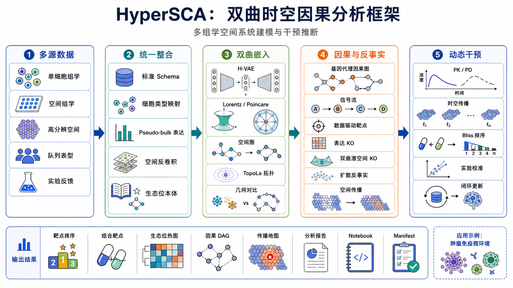

<p align="center">
  
</p>

[](https://github.com/luvega/HyperSCA/actions/workflows/ci.yml)

HyperSCA (Hyperbolic Spatiotemporal Causal Analysis) 是一个面向空间组学与单细胞组学联合分析的多组学计算框架。该框架集成双曲几何嵌入、因果图发现和反事实扰动分析，支持 scRNA-seq、空间转录组及临床/表型分层数据的联合建模，用于机制推断与可干预靶点评估。除肿瘤免疫场景外，也可用于自身免疫、慢性炎症、感染及组织损伤修复等疾病环境。

HyperSCA is a multi-omics research pipeline for joint single-cell and spatial omics modeling, combining hyperbolic representation learning, causal graph inference, counterfactual perturbation, and spatially aware target prioritization.

## Current Release Status

`v0.6.0` is an evidence-gated audit baseline. It consolidates the reviewed spatial-annotation and admission/from-scratch gates already merged through PRs #1-#5, and publishes a reproducible research assessment of causal inference, spatial perturbation, and drug-mechanism methods. HyperSCA remains an audit-stage research prototype: the release does not promote the hyperbolic v3/energy sidecars, claim state-of-the-art performance, or assert externally validated spatial drug mechanisms.

- [v0.6.0 release notes](docs/releases/v0.6.0.md)
- [HyperSCA progress and research landscape report](reports/research/hypersca_causal_spatial_drug_landscape_20260810.md)
- [Bear evidence synthesis](reports/research/bear_hypersca_spatial_causal_20260810/report.md)
- [Comparison matrix](reports/research/bear_hypersca_spatial_causal_20260810/comparison_matrix.tsv)
- [Innovation claim register](reports/research/bear_hypersca_spatial_causal_20260810/innovation_claim_register.tsv)
- [Frozen Tasks C/S/D benchmark contract](docs/research/benchmark_contract_v1.md)

Validate the preregistered comparison contract before running a new benchmark:

```bash
python scripts/validate_benchmark_contract.py
```

The contract freezes Tasks C/S/D, five seeds, split and feature rules, equal tuning
budgets, simple baselines, null controls, coverage/abstention gates, and conservative
promotion criteria. A valid contract is not a benchmark result; all tasks remain
`not_evaluated` until external holdouts and required baselines are run.

## Project and Algorithm Overview

HyperSCA 的研究完整版流程由六个连续阶段构成，可按具体队列与研究问题灵活裁剪：

- Phase D0（Data Onboarding）：四项目标准化入库与字段校验。
- Stage 1（Embedding）：在 Lorentz/Poincare 双曲流形上学习细胞状态表示。
- Stage 2（Causal）：在去缠结潜变量上执行因果结构发现与信号流推断。
- Stage 3（Counterfactual）：在潜空间做基因扰动并模拟空间传播，完成靶点排序与去假阳性过滤。
- Stage 4（Dynamic Intervention）：在 PK/PD 约束下执行时序传播与联靶组合干预评估，并支持实验回写后的 roundtrip 更新。
- Stage 5（Behavior Grammar / Virtual Tissue）：将 target discovery 与 Step4 证据翻译为可读细胞行为规则，并运行轻量虚拟组织模拟；该层为可选 sidecar，不替换 Step1-Step4。

## Pipeline Flowchart



## Benchmark Sidecar and Module Selection

Benchmark 是 HyperSCA 的方法筛选和模块准入旁支，用于比较候选空间注释、空间反卷积、双曲嵌入和下游靶点发现模块是否值得进入主流程。它不替代 Phase D0 到 Stage 5 的主框架，也不应直接改写 active target ranking；只有在出现非零 target rank delta、target enrichment 改善，或可复查的空间生态位生物学收益时，候选模块才进入后续 promotion 评估。

2026-06-22 阶段性 benchmark 保持保守结论：

- 主比较只纳入两个内部训练的 v3 分支：`hvae_hierarchy_spatial_v3_product` 与 `hvae_hierarchy_spatial_v3_product__without_radial_depth_loss`。
- SCimilarity 仅作为 external pretrained appendix reference，不作为主排名竞争对象。
- 两个 v3 分支仍为 `audit_only_no_promotion`：target rank delta 仍为 0，target enrichment 尚未改善，prototype/radial hierarchy 监督仍接近 chance。
- VisiumHD full cell2location 已通过 545,913 行 abundance 输出校验；VisiumHD segmented RCTD 作为近单细胞分辨率空间对照。
- Xenium 保持 panel-aware 分支；targeted panel 数据不运行 whole-transcriptome RCTD/cell2location 假设。

当前阶段性审计材料保留为 compact reports 和 figures：

- [Benchmark progress report](docs/research/hypersca_benchmark_progress_20260622.md)
- [Benchmark JSON snapshot](docs/research/hypersca_benchmark_progress_20260622.json)
- [Project progress inventory](docs/research/hypersca_project_progress_inventory_20260622.md)
- [GitHub submission notes](docs/github_submission_20260622.md)
- [Current workflow figure](docs/research/figures/hypersca_current_pipeline_flowchart_20260622.png)
- [Two-candidate downstream summary figure](docs/research/figures/hypersca_two_candidate_downstream_summary_20260622.png)

## Core Algorithms

### 1) Hyperbolic Embedding

- 关键模块：`src/models/hyperbolic/lorentz.py`, `src/models/hyperbolic/poincare.py`, `src/models/hyperbolic/wrapped_normal.py`, `src/models/hyperbolic/hvae.py`
- 目的：在双曲空间中更好地保持细胞层级结构与远近关系，降低欧氏空间下的几何失真。

### 2) Causal Discovery and Signaling Flow

- 关键模块：`src/causal/disentangle.py`, `src/causal/cmi_pruning.py`, `src/causal/causal_graph.py`, `src/causal/signaling_flow.py`
- 方法要点：`z_int/z_ext` 去缠结 + PC 条件独立检验 + bootstrap 稳定性 + DoWhy 结构验证 + L-R-TF-Target 多层流。

### 3) Counterfactual Perturbation and Spatial Propagation

- 关键模块：`src/perturbation/latent_arithmetic.py`, `src/perturbation/spatial_propagation.py`, `src/perturbation/diffusion_cf.py`, `src/perturbation/target_ranking.py`
- 方法要点：潜空间虚拟敲除、因果图约束扩散、空间梯度衰减拟合、靶点可干预性排序。

### 4) Niche and Cross-sample Stratification

- 关键模块：`src/evaluation/cross_sample_metrics.py`
- 方法要点：生态位聚类（niche clustering）、跨样本边一致性、临床/表型分层差异检验，纳入最终证据矩阵。

### 5) Modular Target Discovery

- 入口脚本：`scripts/run_target_discovery.py` 现在是 thin CLI，只负责解析参数、构造 `TargetDiscoveryConfig` 并调用 pipeline。
- 核心包：`src/discovery/target_discovery/`
  - `config.py`、`pipeline.py`、`stage.py`、`artifacts.py` 定义配置、编排、stage 协议与 run manifest。
  - `loaders.py`、`candidates.py`、`expression.py`、`spatial.py` 构建轻量数据输入。
  - `geometry.py`、`causal_stage.py`、`perturbation_stage.py`、`scoring.py`、`niche.py`、`reporting.py`、`figures.py` 负责双几何比较、Step2/Step3 wrapper、证据排序、生态位映射、报告和图。
- 输出根目录：默认写入 `results/discovery/target_discovery/<run_id>/`，按 `candidates/`、`expression/`、`spatial/`、`geometry/{mode}/`、`causal/{mode}/`、`perturbation/{mode}/`、`scoring/`、`niche/`、`reports/`、`figures/` 分区，并生成 `manifest.json` 与 `reports/migration_notes.md`。

### 6) Behavior Grammar and Virtual Tissue Simulation

- 入口脚本：`scripts/run_behavior_grammar_simulation.py`
- 核心包：`src/behavior_grammar/`
  - `rules.py` 定义 `BehaviorRule`, `SignalDictionary`, `BehaviorDictionary`, `RuleSet` 与 Hill/linear/step response。
  - `rule_builder.py` 从 `results/discovery/target_discovery/<run_id>/manifest.json`、评分表、因果边、生态位映射和表达矩阵生成数据驱动规则。
  - `simulation.py` 运行确定性 toy virtual tissue simulation，并输出 QoI sensitivity 与组合干预场景比较。
  - `pipeline.py` 复用 run-scoped artifact manifest，写入规则、轨迹、summary、敏感性表和动态图。
- 输出根目录：默认写入 `results/behavior_grammar/<run_id>/`，包含 `rules/rules.json`、`rules/rules.md`、`simulation/population_trajectory.csv`、`simulation/simulation_summary.json`、`simulation/qoi_sensitivity.csv` 与 `figures/population_trajectories.png`。

## Example Data Samples

项目常用示例输入（路径为本地外部数据目录，不纳入版本控制；以下为脱敏占位路径）：

- `<PATH_TO_scRNA_REFERENCE>`
  - 代表文件：`*-NormalizedCounts.tsv`, `*-DE_result.tsv`
  - 用途：构建 cluster-level 表达矩阵、候选差异基因池与细胞状态先验。
- `<PATH_TO_SPATIAL_OMICS>`
  - 代表文件：`STmetadata_*.csv`, `spot_annotations.*`
  - 用途：空间反卷积、细胞共定位邻接、传播梯度与生态位结构评估。
- `<PATH_TO_CLINICAL_OR_PHENOTYPE>`
  - 代表文件：`sample_clinical_mapping.csv`, `group_labels.csv`
  - 用途：临床/表型分层（如免疫亚型、疾病分期、治疗反应）及跨样本差异分析。

统一标准化输出（示例）：

- `results/integration/schema/sample_table.csv`
- `results/integration/schema/entity_table.csv`
- `results/integration/schema/feature_table.csv`
- `results/integration/schema/measure_table.csv`

## Installation Guide

### 1) Create Conda Environment

```bash
conda create -n hypersca python=3.10 -y
conda activate hypersca
```

### 2) Install the Core CPU Environment

```bash
python -m pip install --upgrade pip
python -m pip install torch --index-url https://download.pytorch.org/whl/cpu
python -m pip install -e ".[dev]"
```

`pyproject.toml` exposes HyperSCA as an editable Python package while retaining
the existing `src.*` import paths. Core CPU dependencies are maintained in
`requirements-core.txt`. To add the extended single-cell, spatial, causal, and
notebook stack, run:

```bash
python -m pip install -r requirements.txt
```

GPU 环境需要先从 PyTorch 官方索引安装与本机 CUDA 对应的 `torch`，再从
[PyG wheel matrix](https://data.pyg.org/whl/) 安装版本匹配的编译扩展。扩展名维护在
`requirements-gpu.txt`，不进入 CPU/CI 依赖解析。历史扰动 baseline 则单独安装；
核心流程不依赖 `scgen`：

```bash
pip install -r requirements-optional-baselines.txt
```

### 3) Validate Runtime Environment

```bash
python scripts/validate_env.py --profile core-cpu
pytest tests -q
```

验证档位与依赖边界对应：

- `core-cpu`：CI 与无加速器开发环境；不检查 CUDA 或编译型 PyG 扩展。
- `gpu`：核心依赖 + CUDA + 编译型 PyG 扩展。
- `full`：完整科研栈 + GPU/PyG；也是不传 `--profile` 时的兼容默认值。

`scgen` 仅作为 `full` 档位中的可选历史 baseline 检查；缺失或因
`scvi-tools` 版本不兼容导入失败时会报告 warning，但不会单独阻断验证。

## Quick Start

### Multi-omics Integration Example (推荐)

展示 HyperSCA **多组学整合分析**核心能力的完整示例（6 个 notebook，含嵌入图表）：

- `notebooks/example_multiomics_integration/README.md`
- `00_data_landscape` → `01_hyperbolic_vs_euclidean` → `02_multiscale_niche` → `03_causal_network` → `04_target_discovery` → `05_summary`

核心对比结果：

| 指标 | scRNA-only + Euclidean | Multi-omics + Hyperbolic | 提升 |
|------|----------------------|-------------------------|------|
| Niche Silhouette | 0.417 | **0.710** | **+70%** |
| Hierarchy Correlation | −0.569 | **+1.000** | 反转→完美 |
| 证据维度 | 3 | **5** (+spatial, +niche) | +2 独立维度 |

数据规模：485K spots × 3 空间平台 + 3 scRNA-seq 队列，**靶点发现完全数据驱动**（无预设 anchor）。

### Step-by-step scCRC_ICB (单细胞基础流程)

如需仅基于 scRNA-seq 数据按主流程逐步运行：

- `notebooks/example_sccrc_icb_step_by_step/README.md`
- `notebooks/example_sccrc_icb_step_by_step/00_environment_and_data_check.ipynb` 到 `05_step4_dynamic_intervention_and_summary.ipynb`

### A. Build Canonical Schema

```bash
python scripts/build_canonical_schema.py
```

### A0. Onboard Multi-cohort Data to `/data`

说明：脚本参数名保留历史命名（`icb/neu/st/ifng`），但可映射到任意疾病场景的数据根目录。

```bash
python scripts/run_data_onboarding.py \
  --icb-root <PATH_TO_COHORT_A> \
  --neu-root <PATH_TO_COHORT_B> \
  --st-root <PATH_TO_SPATIAL_OMICS> \
  --ifng-root <PATH_TO_COHORT_D>
```

### B. Run Step1 (Hyperbolic Embedding)

```bash
python scripts/run_step1.py \
  --data-dir data/ST/<YOUR_SPATIAL_PROJECT> \
  --modality visium \
  --output-dir results/step1
```

### C. Run Step2 (Spatial Causal Inference)

```bash
python scripts/run_step2.py \
  --input-dir results/step1 \
  --output-dir results/step2
```

Step2 后可运行 append-only 稳定性审计。默认 `--n-null-controls 0` 保留历史
行为；需要频率/拓扑 surrogate null 时显式固定数量、模式和 seed：

```bash
python scripts/run_causal_stability_audit.py \
  --step2-dir results/step2 \
  --n-null-controls 100 \
  --null-modes matrix_permutation,node_label_shuffle,outgoing_weight_permutation \
  --random-seed 42
```

输出包含 `null_control_manifest.json` 与摘要哈希。此审计只打乱已保存的
bootstrap-frequency 矩阵，不等价于对原始细胞、处理、坐标或先验进行打乱后
重拟合；因此只用于 causal-candidate sidecar，不能作为干预因果证明。

### D. Run Step3 (Counterfactual Perturbation)

```bash
python scripts/run_step3.py \
  --input-step1 results/step1 \
  --input-step2 results/step2 \
  --output-dir results/step3
```

### E. Run Target Discovery and Hub Retention

```bash
python scripts/run_target_discovery.py \
  --run-id demo_target_discovery \
  --max-perturb 10 \
  --geometry-k 4 \
  --geometry-blend 0.30 \
  --platform all \
  --score-profile evidence_gated \
  --skip-figures
```

默认输出位于 `results/discovery/target_discovery/<run_id>/`。旧版展示口径中的预计算发现结果仍保留在 `results/integration/discovery/`，用于 notebook 和 README 中的历史图表展示。

`evidence_gated` 是默认且唯一允许进入主排名解释的策略：先按独立 DE
来源数分层，再依次比较方向一致性、显著性和效应量；`final_score` 仅用于显示
顺序，不是加权证据分数。因果图、空间传播代理和机制先验会写入审计列，但不
改变排名。每次运行都会生成 `scoring/ranking_policy.json` 和
`scoring/module_admission.csv`。`legacy_full` 仅用于历史加权排名复现，不能用于
promotion。CLI 不接受人工基因/靶点种子。

### F. Run Dynamic Intervention (Step4) and Roundtrip Update

```bash
python scripts/run_step4.py --with-roundtrip \
  --experiment-file data/metadata/experiment_roundtrip.csv
```

### G. Run Behavior Grammar Sidecar (Stage5)

无需真实 discovery manifest、只想查看行为语法模拟产物时，可先运行 demo：

```bash
python scripts/run_behavior_grammar_simulation.py \
  --demo \
  --run-id demo_behavior_grammar \
  --time-steps 8
```

真实 target discovery run 则指定 manifest：

```bash
python scripts/run_behavior_grammar_simulation.py \
  --discovery-manifest results/discovery/target_discovery/<run_id>/manifest.json \
  --step4-dir results/step4 \
  --run-id <run_id>
```

该 sidecar 读取 target discovery run manifest 和可选 Step4 context，生成可读规则、虚拟组织轨迹、QoI sensitivity 与动态图。它不改变 Step1-Step4 CLI 输出契约。

### H. Generate CNS-style Figures (Step1/2/3)

```bash
python scripts/generate_step1_figures.py
python scripts/generate_step2_figures.py
python scripts/generate_step3_figures.py
```

## Key Outputs

- Canonical schema and metadata: `data/metadata/`, `results/integration/schema/`
- Step1 outputs: `results/step1/` (`adata_embedded.h5ad`, `embedding_benchmark.json`)
- Step2 outputs: `results/step2/`（因果图、稳定性指标、baseline 对比）
- Step3 outputs: `results/step3/`（扰动结果、去假阳性靶点与组合）
- Target discovery runs: `results/discovery/target_discovery/<run_id>/`（run manifest、候选池、几何比较、Step2/Step3 wrapper 产物、评分表、生态位映射、报告、迁移说明）
- Legacy/precomputed discovery reports for notebooks: `results/integration/discovery/`
- Step4 outputs: `results/step4/`（`pkpd_summary.json`, `combination_ranking.csv`, `roundtrip_update_report.json`）
- Behavior grammar outputs: `results/behavior_grammar/<run_id>/`（可读规则、simulation summary、QoI sensitivity、虚拟组织轨迹图）
- CNS figure outputs: `results/figures/step1/`, `results/figures/step2/`, `results/figures/step3/`

## 项目目录说明

完整的本地目录边界、提交文件说明、验证代码说明、结果目录说明、历次更新记录和当前项目进度见 [docs/project_inventory.md](docs/project_inventory.md)。

## Testing

```bash
pytest tests -q -p no:cacheprovider
pytest tests/discovery -q
pytest tests/behavior_grammar -q
```

## License

MIT License.
