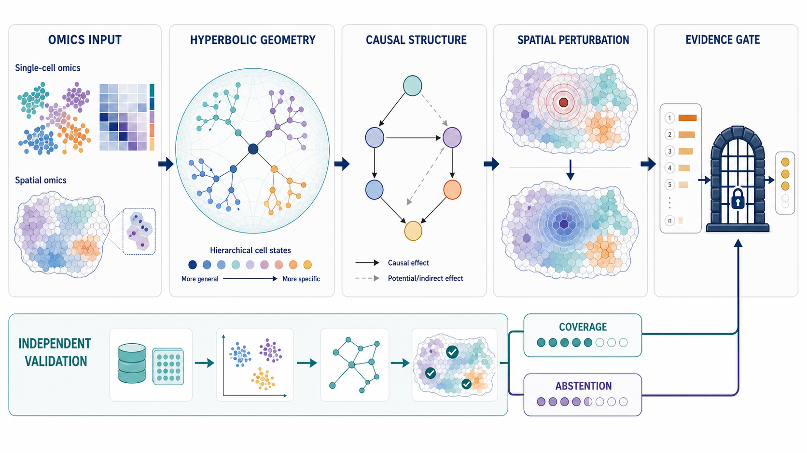

<p align="center">
  
</p>

**[中文](README.md)** | [English](README_EN.md)

[](https://github.com/luvega/HyperSCA/actions/workflows/ci.yml)

HyperSCA（Hyperbolic Spatiotemporal Causal Analysis）是一套联合处理单细胞和空间组学数据的多步骤分析流程（pipeline）。它先用双曲表示（hyperbolic embedding）整理细胞状态及其层级关系，再推断候选因果关系图，并用反事实扰动模拟评估候选靶点。结果用于形成待验证的机制假设和干预候选，不能单独证明药物机制或治疗效果。项目支持 scRNA-seq、空间转录组及临床/表型分层数据，可用于肿瘤免疫、自身免疫、慢性炎症、感染和组织损伤修复等研究场景。

## 当前发布状态

`v0.7.0` 是面向可审计方法比较与空间扰动桥接的研究版本。它继续遵循“由直接证据决定结论等级”的原则，并把比较约定、数据隔离、可作出判断的比例和证据发布路径固定为可重放工件。HyperSCA 仍是 Alpha 阶段的研究原型：软件检查通过不等于生物学或临床验证，也不构成最先进性能声明。

- Methods v3 固定任务 C/S/D 的比较角色、统计单位、资源边界、coverage、abstention 和保守升级条件。
- 空间扰动桥接使用整只动物隔离的数据划分，并把候选登记、近邻、效应评分、简单对照和证据发布连接成可重放流程。
- 运行证据必须通过身份、输入、工件和集合层检查；失败或资料不足状态不能被结果摘要改写成成功。
- 导入架构和属性测试限制命令行入口、科学模块和证据模块之间的依赖方向，降低绕过冻结约定的风险。

真实 GSE274447 空间扰动 pilot 没有运行，因为登记的外部队列根目录在执行环境中不存在。v0.7.0 只发布这一 stop-gate 事实；没有虚构 pilot 结果、预测能力工件或模块升级结论。

- [v0.7.0 发布说明](docs/releases/v0.7.0.md)
- [v0.6.0 历史发布说明](docs/releases/v0.6.0.md)
- [HyperSCA 进度与研究版图报告](reports/research/hypersca_causal_spatial_drug_landscape_20260810.md)
- [Bear 支持与反对证据综合报告](reports/research/bear_hypersca_spatial_causal_20260810/report.md)
- [现有方法比较表](reports/research/bear_hypersca_spatial_causal_20260810/comparison_matrix.tsv)
- [创新结论与证据登记表](reports/research/bear_hypersca_spatial_causal_20260810/innovation_claim_register.tsv)
- [任务 C/S/D 预先固定的比较规则（benchmark contract）](docs/research/benchmark_contract_v1.md)
- [项目术语与表达指南](docs/style/plain_language_terminology.md)：说明本文档如何用通俗文字解释标准术语，并保持科学证据边界。

运行新的方法对照评估前，先检查预先登记的比较规则是否完整：

```bash
python scripts/validate_benchmark_contract.py
```

规则固定任务 C/S/D、五个随机起点、数据划分与特征规则、相同的参数尝试上限、简单对照方法（baselines）、零效应对照以及保守的证据升级条件。它还要求报告可作出判断的比例（coverage）和暂不判断的比例（abstention）。规则检查通过并不等于方法比较已经完成；在外部独立验证数据（holdouts）和强制简单对照运行完毕前，所有任务保持 `not_evaluated`。

任务 C 现已包含可重复的均值差简单对照方法。它兼容 CausalBench 发布的三数组 NPZ 数据和模型调用形式。详见[任务 C 均值差简单对照方法 v1](docs/research/task_c_mean_difference_baseline_v1.md)。

任务 S 提供配对的 `own_only` 与 `fixed_distance_decay` 空间简单对照方法。两者共享同一份上游自身效应预测，并分开报告自身终点和邻近终点。详见[任务 S 空间简单对照方法 v1](docs/research/task_s_simple_baselines_v1.md)。

## 项目与方法概览

HyperSCA 的研究完整版流程由六个连续阶段构成，可按具体队列与研究问题灵活裁剪：

- 阶段 D0（数据接入，Data Onboarding）：将四个项目整理为统一格式并检查字段。
- 阶段 1（双曲表示，Embedding）：在 Lorentz/Poincare 双曲流形上学习细胞状态表示。
- 阶段 2（因果分析，Causal）：在分离后的潜在变量上发现候选因果结构并推断信号流。
- 阶段 3（反事实扰动，Counterfactual）：在潜在表示空间模拟基因扰动和空间传播，形成靶点排序并过滤可能的假阳性。
- 阶段 4（动态干预，Dynamic Intervention）：在 PK/PD 约束下评估随时间传播的效应和多靶点组合，并支持实验结果回写后的往返更新。
- 阶段 5（行为规则与虚拟组织，Behavior Grammar / Virtual Tissue）：把靶点发现和阶段 4 证据翻译成可读的细胞行为规则，再运行轻量虚拟组织模拟。该阶段是可选补充，不替换阶段 1—4。

## 设计思路图



## 方法对照评估与模块选择

方法对照评估（benchmark）是 HyperSCA 的模块筛选补充，用于比较候选空间注释、空间反卷积、双曲表示和下游靶点发现方法是否值得进入主要分析。它不替代阶段 D0—5，也不直接改变当前候选靶点排序。只有出现非零 `target rank delta`、`target enrichment` 改善，或可复查的空间生态位生物学收益时，候选模块才进入后续证据升级评估。

2026-06-22 阶段性方法对照保持以下保守结论：

- 主比较只纳入两个内部训练的 v3 分支：`hvae_hierarchy_spatial_v3_product` 与 `hvae_hierarchy_spatial_v3_product__without_radial_depth_loss`。
- SCimilarity 仅作为外部预训练参考方法（external pretrained appendix reference），不作为主要排名的竞争对象。
- 两个 v3 分支仍为 `audit_only_no_promotion`：`target rank delta` 仍为 0，`target enrichment` 尚未改善，prototype/radial hierarchy 监督仍接近随机水平。
- VisiumHD 完整数据规模的 cell2location 已通过 545,913 行丰度结果检查；基于分割结果的 RCTD 作为近单细胞分辨率空间对照。
- Xenium 保持按测量基因面板处理的分支（panel-aware）；定向基因面板数据不采用全转录组 RCTD/cell2location 假设。

当前阶段性审计材料保留为简要报告和图：

- [方法对照进度报告](docs/research/hypersca_benchmark_progress_20260622.md)
- [方法对照 JSON 快照](docs/research/hypersca_benchmark_progress_20260622.json)
- [项目进度清单](docs/research/hypersca_project_progress_inventory_20260622.md)
- [GitHub 提交说明](docs/github_submission_20260622.md)
- [当前工作流程图](docs/research/figures/hypersca_current_pipeline_flowchart_20260622.png)
- [两个候选方法的下游结果汇总图](docs/research/figures/hypersca_two_candidate_downstream_summary_20260622.png)

## 核心分析方法

### 1）双曲空间中的细胞状态表示

- 关键模块：`src/models/hyperbolic/lorentz.py`, `src/models/hyperbolic/poincare.py`, `src/models/hyperbolic/wrapped_normal.py`, `src/models/hyperbolic/hvae.py`
- 目的：在双曲空间中更好地保持细胞层级结构与远近关系，降低欧氏空间下的几何失真。

### 2）候选因果关系与信号流

- 关键模块：`src/causal/disentangle.py`, `src/causal/cmi_pruning.py`, `src/causal/causal_graph.py`, `src/causal/signaling_flow.py`
- 方法要点：分离 `z_int/z_ext` + PC 条件独立检验 + 重复抽样稳定性检查（bootstrap）+ DoWhy 结构检查 + L-R-TF-Target 多层信号流。

### 3）反事实扰动与空间传播

- 关键模块：`src/perturbation/latent_arithmetic.py`, `src/perturbation/spatial_propagation.py`, `src/perturbation/diffusion_cf.py`, `src/perturbation/target_ranking.py`
- 方法要点：潜空间虚拟敲除、因果图约束扩散、空间梯度衰减拟合、靶点可干预性排序。

### 4）空间生态位与跨样本分层

- 关键模块：`src/evaluation/cross_sample_metrics.py`
- 方法要点：生态位聚类（niche clustering）、跨样本边一致性、临床/表型分层差异检验，纳入最终证据矩阵。

### 5）可组合的候选靶点发现

- 入口脚本：`scripts/run_target_discovery.py` 是简洁的命令行使用方式（CLI），只负责读取参数、构造 `TargetDiscoveryConfig` 并启动分析。
- 核心包：`src/discovery/target_discovery/`
  - `config.py`、`pipeline.py`、`stage.py`、`artifacts.py` 定义配置、步骤顺序、阶段约定和本次运行的分析记录清单（manifest）。
  - `loaders.py`、`candidates.py`、`expression.py`、`spatial.py` 构建轻量数据输入。
  - `geometry.py`、`causal_stage.py`、`perturbation_stage.py`、`scoring.py`、`niche.py`、`reporting.py`、`figures.py` 负责双几何比较、步骤 2/3 接入层（wrapper）、证据排序、生态位映射、报告和图。
- 输出根目录：默认写入 `results/discovery/target_discovery/<run_id>/`，按 `candidates/`、`expression/`、`spatial/`、`geometry/{mode}/`、`causal/{mode}/`、`perturbation/{mode}/`、`scoring/`、`niche/`、`reports/`、`figures/` 分区，并生成 `manifest.json` 与 `reports/migration_notes.md`。

### 6）细胞行为规则与虚拟组织模拟

- 入口脚本：`scripts/run_behavior_grammar_simulation.py`
- 核心包：`src/behavior_grammar/`
  - `rules.py` 定义 `BehaviorRule`、`SignalDictionary`、`BehaviorDictionary`、`RuleSet`，以及 Hill、线性和阶跃响应。
  - `rule_builder.py` 从 `results/discovery/target_discovery/<run_id>/manifest.json`、评分表、因果边、生态位映射和表达矩阵生成数据驱动规则。
  - `simulation.py` 运行确定性的简化虚拟组织模拟（toy virtual tissue simulation），并输出关注结果量敏感性（QoI sensitivity）和组合干预场景比较。
  - `pipeline.py` 复用本次运行专用的可复查分析输出文件（artifacts）清单，写入规则、轨迹、摘要、敏感性表和动态图。
- 输出根目录：默认写入 `results/behavior_grammar/<run_id>/`，包含 `rules/rules.json`、`rules/rules.md`、`simulation/population_trajectory.csv`、`simulation/simulation_summary.json`、`simulation/qoi_sensitivity.csv` 与 `figures/population_trajectories.png`。

## 示例数据

项目常用示例输入（路径为本地外部数据目录，不纳入版本控制；以下为脱敏占位路径）：

- `<PATH_TO_scRNA_REFERENCE>`
  - 代表文件：`*-NormalizedCounts.tsv`, `*-DE_result.tsv`
  - 用途：构建细胞群层面的表达矩阵、候选差异基因池和细胞状态先验。
- `<PATH_TO_SPATIAL_OMICS>`
  - 代表文件：`STmetadata_*.csv`, `spot_annotations.*`
  - 用途：空间反卷积、细胞共定位邻接、传播梯度与生态位结构评估。
- `<PATH_TO_CLINICAL_OR_PHENOTYPE>`
  - 代表文件：`sample_clinical_mapping.csv`, `group_labels.csv`
  - 用途：临床/表型分层（如免疫亚型、疾病分期、治疗反应）及跨样本差异分析。

统一标准化输出（示例）：

- `results/integration/schema/sample_table.csv`
- `results/integration/schema/entity_table.csv`
- `results/integration/schema/feature_table.csv`
- `results/integration/schema/measure_table.csv`

## 安装说明

### 1）创建 Conda 环境

```bash
conda create -n hypersca python=3.10 -y
conda activate hypersca
```

### 2）安装核心 CPU 环境

```bash
python -m pip install --upgrade pip
python -m pip install torch --index-url https://download.pytorch.org/whl/cpu
python -m pip install -e ".[dev]"
```

`pyproject.toml` 允许在修改源码后直接使用新版本，同时保留现有的 `src.*` 导入路径。核心 CPU 依赖记录在 `requirements-core.txt`。如需安装扩展的单细胞、空间、因果分析和交互式笔记本组件，运行：

```bash
python -m pip install -r requirements.txt
```

GPU 环境需要先从 PyTorch 官方索引安装与本机 CUDA 对应的 `torch`，再从 [PyG 版本对应表](https://data.pyg.org/whl/) 安装匹配的编译扩展。扩展名记录在 `requirements-gpu.txt`，不会进入 CPU 或持续检查环境的依赖。历史扰动简单对照方法需单独安装；核心分析不依赖 `scgen`：

```bash
pip install -r requirements-optional-baselines.txt
```

### 3）检查运行环境

```bash
python scripts/validate_env.py --profile core-cpu
pytest tests -q
```

验证档位与依赖边界对应：

- `core-cpu`：CI 与无加速器开发环境；不检查 CUDA 或编译型 PyG 扩展。
- `gpu`：核心依赖 + CUDA + 编译型 PyG 扩展。
- `full`：完整科研栈 + GPU/PyG；也是不传 `--profile` 时的兼容默认值。

`scgen` 仅作为 `full` 档位中的可选历史简单对照方法检查。缺失或因 `scvi-tools` 版本不兼容而无法导入时会给出警告，但不会单独阻断环境检查。

## 快速开始

### 多组学整合示例（推荐）

该示例用 6 个交互式分析笔记本展示 HyperSCA 的多组学整合过程，并包含主要图表：

- `notebooks/example_multiomics_integration/README.md`
- `00_data_landscape` → `01_hyperbolic_vs_euclidean` → `02_multiscale_niche` → `03_causal_network` → `04_target_discovery` → `05_summary`

核心对比结果：

| 指标 | scRNA-only + Euclidean | Multi-omics + Hyperbolic | 提升 |
|------|----------------------|-------------------------|------|
| Niche Silhouette | 0.417 | **0.710** | **+70%** |
| Hierarchy Correlation | −0.569 | **+1.000** | 反转→完美 |
| 证据维度 | 3 | **5** (+spatial, +niche) | +2 独立维度 |

数据规模：485K 个空间位置 × 3 个空间平台 + 3 个 scRNA-seq 队列，**靶点发现完全由数据驱动**（无预设锚定对象，anchor）。

### scCRC_ICB 分步示例（单细胞基础流程）

如需仅基于 scRNA-seq 数据按主流程逐步运行：

- `notebooks/example_sccrc_icb_step_by_step/README.md`
- `notebooks/example_sccrc_icb_step_by_step/00_environment_and_data_check.ipynb` 到 `05_step4_dynamic_intervention_and_summary.ipynb`

### A. 建立统一数据字段规范

```bash
python scripts/build_canonical_schema.py
```

### A0. 将多个队列整理到 `/data`

说明：脚本参数名保留历史命名（`icb/neu/st/ifng`），但可映射到任意疾病场景的数据根目录。

```bash
python scripts/run_data_onboarding.py \
  --icb-root <PATH_TO_COHORT_A> \
  --neu-root <PATH_TO_COHORT_B> \
  --st-root <PATH_TO_SPATIAL_OMICS> \
  --ifng-root <PATH_TO_COHORT_D>
```

### B. 运行步骤 1（双曲表示）

```bash
python scripts/run_step1.py \
  --data-dir data/ST/<YOUR_SPATIAL_PROJECT> \
  --modality visium \
  --output-dir results/step1
```

### C. 运行步骤 2（空间因果推断）

```bash
python scripts/run_step2.py \
  --input-dir results/step1 \
  --output-dir results/step2
```

步骤 2 后可运行只新增结果、不覆盖原结果的稳定性检查。默认 `--n-null-controls 0` 保留历史行为；如需频率或网络结构的随机零效应对照，应明确固定数量、模式和随机起点：

```bash
python scripts/run_causal_stability_audit.py \
  --step2-dir results/step2 \
  --n-null-controls 100 \
  --null-modes matrix_permutation,node_label_shuffle,outgoing_weight_permutation \
  --random-seed 42
```

输出包含 `null_control_manifest.json` 和文件内容指纹摘要。该检查只重排已保存的重复抽样频率矩阵，不等于重排原始细胞、处理、坐标或先验后重新拟合。因此，结果只作为因果候选关系的补充证据，不能证明干预因果效应。

### D. 运行步骤 3（反事实扰动）

```bash
python scripts/run_step3.py \
  --input-step1 results/step1 \
  --input-step2 results/step2 \
  --output-dir results/step3
```

### E. 运行候选靶点发现并保留网络枢纽

```bash
python scripts/run_target_discovery.py \
  --run-id demo_target_discovery \
  --max-perturb 10 \
  --geometry-k 4 \
  --geometry-blend 0.30 \
  --platform all \
  --score-profile evidence_gated \
  --skip-figures
```

默认输出位于 `results/discovery/target_discovery/<run_id>/`。旧版展示所用的预计算发现结果仍保留在 `results/integration/discovery/`，供交互式笔记本和 README 中的历史图表使用。

`evidence_gated` 是默认且唯一允许解释主要排名的策略：先按独立差异表达来源数量分层，再依次比较方向一致性、显著性和效应量。`final_score` 仅用于显示顺序，不是加权证据分数。因果图、空间传播代理和机制先验写入审计列，但不改变排名。每次运行都会生成 `scoring/ranking_policy.json` 和 `scoring/module_admission.csv`。`legacy_full` 仅用于复现历史加权排名，不能用于提高证据等级。命令入口不接受人工指定的基因或靶点种子。

### F. 运行动态干预（步骤 4）并回写实验结果

```bash
python scripts/run_step4.py --with-roundtrip \
  --experiment-file data/metadata/experiment_roundtrip.csv
```

### G. 运行细胞行为规则补充分析（阶段 5）

如果没有真实的靶点发现记录，只想查看行为规则模拟输出，可先运行演示数据：

```bash
python scripts/run_behavior_grammar_simulation.py \
  --demo \
  --run-id demo_behavior_grammar \
  --time-steps 8
```

使用真实靶点发现结果时，需要指定对应的记录清单：

```bash
python scripts/run_behavior_grammar_simulation.py \
  --discovery-manifest results/discovery/target_discovery/<run_id>/manifest.json \
  --step4-dir results/step4 \
  --run-id <run_id>
```

该补充分析读取靶点发现的运行记录清单和可选的步骤 4 情境信息，生成可读规则、虚拟组织轨迹、结果量敏感性和动态图。它不改变步骤 1—4 的命令输出约定。

### H. 生成 CNS 风格图（步骤 1/2/3）

```bash
python scripts/generate_step1_figures.py
python scripts/generate_step2_figures.py
python scripts/generate_step3_figures.py
```

## 主要输出

- 统一数据字段和元数据：`data/metadata/`、`results/integration/schema/`
- 步骤 1 输出：`results/step1/`（`adata_embedded.h5ad`、`embedding_benchmark.json`）
- 步骤 2 输出：`results/step2/`（因果关系图、稳定性指标、简单对照结果）
- 步骤 3 输出：`results/step3/`（扰动结果、过滤可能假阳性后的靶点和组合）
- 候选靶点发现：`results/discovery/target_discovery/<run_id>/`（运行记录、候选池、几何比较、步骤 2/3 接入结果、评分表、生态位映射、报告和迁移说明）
- 供交互式笔记本使用的历史预计算报告：`results/integration/discovery/`
- 步骤 4 输出：`results/step4/`（`pkpd_summary.json`、`combination_ranking.csv`、`roundtrip_update_report.json`）
- 细胞行为规则输出：`results/behavior_grammar/<run_id>/`（可读规则、模拟摘要、结果量敏感性和虚拟组织轨迹图）
- CNS 风格图：`results/figures/step1/`、`results/figures/step2/`、`results/figures/step3/`

## 项目目录说明

完整的本地目录边界、提交文件说明、验证代码说明、结果目录说明、历次更新记录和当前项目进度见 [docs/project_inventory.md](docs/project_inventory.md)。

## 运行测试

```bash
pytest tests -q -p no:cacheprovider
pytest tests/discovery -q
pytest tests/behavior_grammar -q
```

## 许可证

MIT License.
