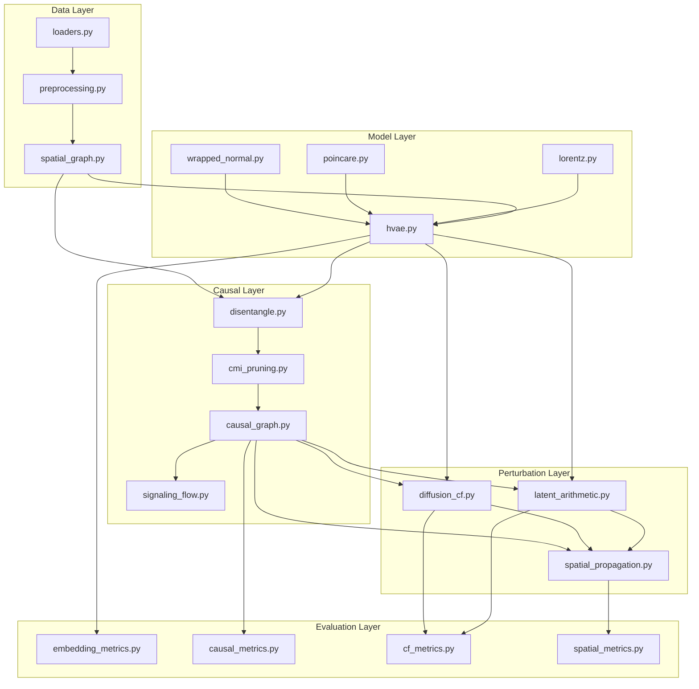

# HyperSCA 工程落地蓝图

*版本: v1.0 | 日期: 2026-02-15*

## v1.1 补充（研究完整版）

- 新增 `scripts/run_data_onboarding.py`：四项目数据标准化入库（`data/scRNA/`, `data/ST/`, `data/metadata/`）。
- 新增 `scripts/run_step4.py`：Step4 动态干预入口，支持 `--with-roundtrip` 执行实验回写后再推理。
- 新增 `src/pipeline/step4_dynamic_intervention.py`：PK/PD + 时序空间传播 + 组合干预评分。
- 新增 `src/pipeline/roundtrip_update.py` 与 `src/data/experiment_roundtrip.py`：干湿回写、参数校准、版本比较报告。
- 新增 `src/causal/temporal_causal.py` 与 `src/perturbation/{pharmacokinetics,dose_response,combinatorial_intervention,temporal_spatial_propagation}.py`：时序因果与动态药效模块。

---

## 1. 项目目录结构

在现有仓库根目录 `E:\HyperSCA\` 下新增 `src/` 模块包，与已有目录并行：

```text
HyperSCA/                         # 工作区根目录
├── HyperSCA/                     # 主 Git 仓库
│   ├── README.md
│   └── LICENSE
├── src/                          # ===== 新增：核心代码 =====
│   ├── __init__.py
│   ├── data/                     # 数据加载与空间图构建
│   │   ├── __init__.py
│   │   ├── loaders.py            # scRNA-seq / ST 多模态数据读取
│   │   ├── preprocessing.py      # 质控、归一化、基因筛选
│   │   └── spatial_graph.py      # k-NN / Delaunay 图 + TopoLa 增强
│   │
│   ├── models/                   # 模型定义
│   │   ├── __init__.py
│   │   └── hyperbolic/           # 双曲嵌入子包
│   │       ├── __init__.py
│   │       ├── hvae.py           # Hyperbolic VAE 主模型
│   │       ├── lorentz.py        # Lorentz 模型工具（ExpMap, LogMap, PT）
│   │       ├── poincare.py       # Poincaré 球映射与距离
│   │       └── wrapped_normal.py # Wrapped Normal 分布
│   │
│   ├── causal/                   # 因果推断与网络构建
│   │   ├── __init__.py
│   │   ├── disentangle.py        # Z_int / Z_ext 解缠（Celcomen 风格）
│   │   ├── cmi_pruning.py        # CMI 计算 + Bootstrap 聚合剪枝
│   │   ├── causal_graph.py       # 因果图数据结构 & 操作
│   │   └── signaling_flow.py     # 多层信号流推断（配体→受体→TF→靶基因）
│   │
│   ├── perturbation/             # 扰动模拟与反事实生成
│   │   ├── __init__.py
│   │   ├── latent_arithmetic.py  # 双曲潜空间扰动算术（CPA/scGen 风格）
│   │   ├── diffusion_cf.py       # 条件扩散反事实生成（CausCell/Squidiff 风格）
│   │   └── spatial_propagation.py # 空间传播模拟
│   │
│   ├── evaluation/               # 评估指标与验证
│   │   ├── __init__.py
│   │   ├── embedding_metrics.py  # 嵌入质量（distortion, ARI, NMI）
│   │   ├── causal_metrics.py     # 因果边可信度（bootstrap freq, falsification）
│   │   ├── cf_metrics.py         # 反事实质量（R2, PCC, MSE, marker matching）
│   │   └── spatial_metrics.py    # 空间一致性（Moran's I, 传播梯度）
│   │
│   ├── pipeline/                 # 端到端编排
│   │   ├── __init__.py
│   │   ├── step1_embedding.py    # 阶段 1 流水线
│   │   ├── step2_causal.py       # 阶段 2 流水线
│   │   ├── step3_perturbation.py # 阶段 3 流水线
│   │   └── config.py             # 全局配置（超参数、路径、设备）
│   │
│   └── utils/                    # 通用工具
│       ├── __init__.py
│       ├── io_utils.py           # 文件读写、日志
│       └── visualization.py      # 嵌入可视化、因果图绘制
│
├── scripts/                      # 运行脚本（已有 validate_env.py）
│   ├── validate_env.py           # 已有
│   ├── run_step1.py              # 阶段 1 运行入口
│   ├── run_step2.py              # 阶段 2 运行入口
│   └── run_step3.py              # 阶段 3 运行入口
│
├── tests/                        # ===== 新增：单元 & 集成测试 =====
│   ├── __init__.py
│   ├── test_data_loaders.py
│   ├── test_spatial_graph.py
│   ├── test_hvae.py
│   ├── test_causal_disentangle.py
│   ├── test_cmi_pruning.py
│   └── test_perturbation.py
│
├── notebooks/                    # ===== 新增：交互式实验 =====
│   ├── 01_data_exploration.ipynb
│   ├── 02_embedding_demo.ipynb
│   ├── 03_causal_network.ipynb
│   └── 04_perturbation_sim.ipynb
│
├── docs/                         # ===== 新增：文档 =====
│   ├── technical_roadmap.md      # 学术化技术路线（交付物 A）
│   └── engineering_blueprint.md  # 本文件（交付物 B）
│
├── data/                         # 数据目录（已 gitignore）
├── references/                   # 参考仓库（只读）
├── requirements-core.txt
├── requirements-research.txt
├── environment-r.yml
├── AGENTS.md
└── SETUP_PROGRESS_2026-02-14.md
```

---

## 2. 统一接口设计（高层 API）

### 2.1 配置系统

```python
# src/pipeline/config.py

from dataclasses import dataclass, field
from typing import Optional, List

@dataclass
class HyperSCAConfig:
    """全局配置"""
    # --- 数据 ---
    data_dir: str = "data/Visium_HumanColon_Oliveira"
    gene_filter_min_cells: int = 10
    n_top_genes: int = 3000

    # --- 空间图 ---
    spatial_k: int = 6                   # k-NN 参数
    topola_lambda: float = 1e-3          # TopoLa 正则化
    use_topola: bool = True

    # --- H-VAE ---
    hvae_latent_dim: int = 32            # 双曲潜空间维度
    hvae_curvature: float = -1.0         # K < 0
    hvae_encoder_layers: List[int] = field(default_factory=lambda: [512, 256, 128])
    hvae_decoder_layers: List[int] = field(default_factory=lambda: [128, 256, 512])
    hvae_beta: float = 1.0              # KL 权重
    hvae_gamma: float = 10.0            # 拓扑正则化权重
    hvae_lr: float = 1e-3
    hvae_epochs: int = 300
    hvae_pretrain_epochs: int = 50

    # --- 因果 ---
    cmi_bootstrap_n: int = 100           # Bootstrap 次数
    cmi_threshold: float = 0.5           # 边频率阈值
    disentangle_alpha: float = 1.0       # HSIC 惩罚权重
    lr_db: str = "cellchatdb"            # 配受体数据库

    # --- 扰动 ---
    target_genes: List[str] = field(default_factory=lambda: ["INHBA", "POSTN", "MFAP2"])
    perturbation_method: str = "latent_arithmetic"  # 或 "diffusion_cf"
    spatial_decay_length: float = 100.0  # 空间衰减尺度 (μm)
    propagation_max_depth: int = 5

    # --- 通用 ---
    device: str = "cuda"
    seed: int = 42
    output_dir: str = "results"
```

### 2.2 核心 API

```python
# src/pipeline/step1_embedding.py

class EmbeddingPipeline:
    """阶段 1：双曲嵌入流水线"""

    def __init__(self, config: HyperSCAConfig):
        ...

    def load_data(self) -> AnnData:
        """加载并预处理 scRNA-seq / ST 数据
        Returns: 预处理后的 AnnData 对象
        """

    def build_spatial_graph(self, adata: AnnData) -> sparse.csr_matrix:
        """构建空间邻域图 + TopoLa 增强
        Returns: 增强邻接矩阵 Ã (scipy sparse)
        """

    def train_hvae(self, adata: AnnData, adj: sparse.csr_matrix) -> dict:
        """训练 Hyperbolic VAE
        Returns: {
            'embeddings': np.ndarray,   # (N, d) Poincaré 嵌入
            'lorentz_emb': np.ndarray,  # (N, d+1) Lorentz 嵌入
            'model': nn.Module,         # 训练后的模型
            'losses': dict              # 训练损失记录
        }
        """

    def run(self) -> dict:
        """端到端执行阶段 1"""
```

```python
# src/pipeline/step2_causal.py

class CausalPipeline:
    """阶段 2：因果通讯网络构建"""

    def __init__(self, config: HyperSCAConfig, embedding_result: dict):
        ...

    def disentangle(self, adata: AnnData) -> dict:
        """因果解缠：分离 Z_int 和 Z_ext
        Returns: {
            'z_int': np.ndarray,  # (N, d1) 内源性状态
            'z_ext': np.ndarray,  # (N, d2) 外源性影响
        }
        """

    def learn_causal_graph(self, z_ext: np.ndarray) -> nx.DiGraph:
        """空间因果结构学习 + CMI 剪枝
        Returns: 有向因果图 (networkx DiGraph)
        """

    def infer_signaling_flow(
        self, causal_graph: nx.DiGraph, adata: AnnData
    ) -> pd.DataFrame:
        """多层信号流推断
        Returns: DataFrame with columns:
            [source_cell, target_cell, ligand, receptor, tf, target_gene, flow_score]
        """

    def run(self, adata: AnnData) -> dict:
        """端到端执行阶段 2"""
```

```python
# src/pipeline/step3_perturbation.py

class PerturbationPipeline:
    """阶段 3：扰动模拟与反事实预测"""

    def __init__(
        self, config: HyperSCAConfig,
        embedding_result: dict,
        causal_result: dict
    ):
        ...

    def virtual_knockout(
        self, gene: str, target_cells: Optional[np.ndarray] = None
    ) -> AnnData:
        """单基因虚拟敲除
        Args:
            gene: 靶基因名称
            target_cells: 可选，指定目标细胞索引；默认为靶基因高表达亚群
        Returns: 反事实 AnnData（.X 为预测表达，.obs 含原始 vs 反事实标注）
        """

    def diffusion_counterfactual(
        self, intervention: dict
    ) -> AnnData:
        """扩散模型反事实生成
        Args:
            intervention: {gene: target_level}，如 {"POSTN": "low"}
        Returns: 反事实 AnnData
        """

    def spatial_propagation(
        self, cf_adata: AnnData, source_cells: np.ndarray
    ) -> AnnData:
        """空间传播预测
        Returns: 带空间扰动扩散注释的 AnnData
        """

    def run(self, genes: Optional[List[str]] = None) -> dict:
        """端到端执行阶段 3"""
```

```python
# src/evaluation/ 各模块的主要接口

def evaluate_embedding(adata, embeddings, labels) -> dict:
    """嵌入质量评估
    Returns: {'distortion': float, 'ari': float, 'nmi': float, 'silhouette': float}
    """

def evaluate_causal_graph(causal_graph, ground_truth=None) -> dict:
    """因果边可信度评估
    Returns: {'bootstrap_freq': dict, 'falsification_pvalue': float,
              'arrow_strength': dict, 'edge_count': int}
    """

def evaluate_counterfactual(observed, predicted, marker_genes) -> dict:
    """反事实质量评估
    Returns: {'r2_mean': float, 'r2_var': float, 'pcc': float, 'mse': float,
              'marker_direction_accuracy': float}
    """

def evaluate_spatial_consistency(adata_cf, spatial_coords) -> dict:
    """空间传播一致性评估
    Returns: {'morans_i': float, 'gradient_decay_r2': float,
              'spatial_causal_correlation': float}
    """
```

---

## 3. 里程碑与分阶段实施

### P0：基础端到端（预计 3-4 周）

**目标**：完成从数据加载到单基因虚拟敲除的最小可运行流水线。

| 子任务 | 模块 | 输入/输出 | 参考来源 | 验收标准 |
|--------|------|-----------|----------|----------|
| P0.1 数据加载 | `src/data/loaders.py` | `.h5ad` → AnnData | scanpy I/O | 成功加载 Visium 数据，shape 与预期一致 |
| P0.2 预处理 | `src/data/preprocessing.py` | raw AnnData → filtered AnnData | scDHMap `preprocess.py` | 基因筛选后 n_genes ≈ 3000，无 NaN |
| P0.3 空间图 | `src/data/spatial_graph.py` | AnnData → sparse adj matrix | TopoLa `utils_TopoLa.py` | k-NN 图连通分量 = 1，TopoLa 增强后非零元素减少 |
| P0.4 H-VAE | `src/models/hyperbolic/hvae.py` | AnnData + adj → embeddings | scDHMap `scDHMap.py` | 训练损失收敛，嵌入在 Poincaré 球内（norm < 1） |
| P0.5 双曲工具 | `src/models/hyperbolic/lorentz.py` 等 | 向量 → 映射结果 | scDHMap helpers | 单元测试通过（ExpMap/LogMap 互逆、距离非负） |
| P0.6 因果解缠 | `src/causal/disentangle.py` | embeddings + adj → Z_int, Z_ext | Celcomen | Z_int 与邻居组成无相关（Spearman p > 0.05） |
| P0.7 基础因果图 | `src/causal/cmi_pruning.py` | Z_ext → DiGraph | FlowSig `learn_intercellular_flows` | 输出有向图非空，边数 < N*(N-1)/2 * 0.1 |
| P0.8 单基因 KO | `src/perturbation/latent_arithmetic.py` | gene + model → cf AnnData | CPA / scGen | INHBA KO 后 CD163 表达降低（方向一致） |
| P0.9 运行脚本 | `scripts/run_step1.py` ~ `run_step3.py` | CLI → results/ | - | 可一键运行全流水线 |

**P0 验收检查清单**：
- [ ] `python scripts/run_step1.py --config default` 成功输出嵌入文件
- [ ] `python scripts/run_step2.py --config default` 成功输出因果图
- [ ] `python scripts/run_step3.py --config default --gene INHBA` 成功输出反事实 AnnData
- [ ] 所有单元测试 (`pytest tests/`) 通过

---

### P1：验证与精炼（预计 3-4 周）

**目标**：引入因果验证、CMI 稀疏化、多层信号流和空间一致性评估。

| 子任务 | 模块 | 描述 | 参考来源 |
|--------|------|------|----------|
| P1.1 DoWhy 验证 | `src/causal/causal_graph.py` | 因果图结构 falsification + arrow strength | DoWhy `gcm` |
| P1.2 CMI 精炼 | `src/causal/cmi_pruning.py` | Block bootstrap + 多阈值敏感性分析 | FlowSig |
| P1.3 信号流 | `src/causal/signaling_flow.py` | 配体→受体→TF→靶基因完整链路 | FlowSig GEM + NicheNet 先验 |
| P1.4 嵌入评估 | `src/evaluation/embedding_metrics.py` | Distortion, ARI, NMI, Silhouette | scDHMap `embedding_quality_score.py` |
| P1.5 因果评估 | `src/evaluation/causal_metrics.py` | Bootstrap freq, falsification p-value | DoWhy |
| P1.6 反事实评估 | `src/evaluation/cf_metrics.py` | R2, PCC, MSE, marker 方向 | CPA / CausCell |
| P1.7 空间评估 | `src/evaluation/spatial_metrics.py` | Moran's I, 传播梯度 | squidpy + 自研 |
| P1.8 多基因 KO | `src/perturbation/latent_arithmetic.py` | 组合扰动（INHBA + POSTN 双 KO） | CPA |
| P1.9 可视化 | `src/utils/visualization.py` | Poincaré 嵌入图、因果网络图、空间热图 | matplotlib + plotly |

**P1 验收检查清单**：
- [ ] 因果图至少通过 DoWhy falsification 的 2/3 独立性检验（p > 0.05）
- [ ] POSTN→TAM 因果边 bootstrap 频率 > 0.6
- [ ] 至少 1 条完整信号流（4 层）被成功推断
- [ ] 评估报告自动生成（`results/evaluation_report.json`）
- [ ] 可视化生成：Poincaré 嵌入图、因果网络 HTML、空间传播热图

---

### P2：高级能力扩展（预计 4-6 周）

**目标**：引入扩散反事实生成、时空传播模拟和远端联动预测。

| 子任务 | 模块 | 描述 | 参考来源 |
|--------|------|------|----------|
| P2.1 扩散 CF | `src/perturbation/diffusion_cf.py` | 条件扩散反事实生成 | CausCell / Squidiff |
| P2.2 因果一致性约束 | `src/perturbation/diffusion_cf.py` | 拓扑序约束 + 因果掩码 | CausCell |
| P2.3 空间传播 | `src/perturbation/spatial_propagation.py` | 多轮迭代传播 + 距离衰减 | DynPerturb |
| P2.4 远端 EMT | `src/perturbation/spatial_propagation.py` | 机械信号转导 → EMT 联动 | 自研 |
| P2.5 跨方法对比 | `src/evaluation/cf_metrics.py` | CPA vs scGen vs Diffusion CF 一致性 | - |
| P2.6 药敏预测 | `src/perturbation/` | 反事实状态 → drug response score | 扩展 |
| P2.7 综合 Dashboard | `notebooks/` | Streamlit 或 Jupyter 交互式报告 | - |

**P2 验收检查清单**：
- [ ] 扩散反事实生成可运行（DDPM 50 步去噪 < 5 min/样本）
- [ ] 空间传播在 3-hop 内收敛
- [ ] CPA 与 Diffusion CF 在 top-50 marker 方向 PCC > 0.7
- [ ] 综合 notebook 可一键执行并生成完整报告

---

## 4. 模块依赖图



---

## 5. 参考实现复用与适配策略

### 5.1 Adapter 模式

为避免直接耦合上游参考代码（版本锁定、API 变化风险），每个可复用组件采用 adapter 封装：

```python
# 示例：TopoLa adapter
# src/data/spatial_graph.py

import numpy as np
from scipy import sparse

def topola_enhance(adj: sparse.csr_matrix, lambda_val: float = 1e-3) -> np.ndarray:
    """TopoLa 拓扑增强邻接矩阵

    适配自 references/TopoLa/.../utils_TopoLa.py::TopoLa()
    本项目重新实现核心 SVD 变换逻辑，不直接 import 参考代码。

    Parameters
    ----------
    adj : sparse.csr_matrix
        原始邻接矩阵
    lambda_val : float
        正则化参数，默认 1e-3

    Returns
    -------
    np.ndarray
        增强后的邻接矩阵（dense）
    """
    A_dense = adj.toarray().astype(np.float64)
    U, s, Vt = np.linalg.svd(A_dense, full_matrices=False)
    s_new = (s ** 3) / (s ** 2 + 1.0 / lambda_val)
    A_enhanced = U @ np.diag(s_new) @ Vt
    return A_enhanced
```

### 5.2 复用映射表

| 本项目模块 | 参考来源 | 适配方式 |
|-----------|----------|----------|
| `spatial_graph.py` | TopoLa `utils_TopoLa.py` | 重写核心 SVD 变换（~30 行），不 import 上游 |
| `hvae.py` | scDHMap `scDHMap.py` | 重构类结构，替换弃用 API（Variable → Tensor），集成 geoopt |
| `lorentz.py` / `poincare.py` | scDHMap `lorentzian_helper.py` / `poincare_helper.py` | 适配并补充 Parallel Transport |
| `wrapped_normal.py` | scDHMap `wrapped_normal.py` | 直接适配，添加 geoopt 兼容层 |
| `disentangle.py` | Celcomen `celcomen` 模型 | 提取 G2G 层 + HSIC 损失，封装为独立模块 |
| `cmi_pruning.py` | FlowSig `learn_intercellular_flows` | 提取 UT-IGSP 调用逻辑 + block bootstrap |
| `latent_arithmetic.py` | CPA `ComPertAPI` / scGen `SCGEN` | 双曲化：添加 ExpMap/LogMap/PT 操作 |
| `diffusion_cf.py` | CausCell / Squidiff | 提取 Diffusion 核心 + 因果掩码约束 |
| `spatial_propagation.py` | DynPerturb | 提取时空传播逻辑 + 距离衰减核 |

---

## 6. 数据流与 I/O 规约

### 6.1 阶段间数据传递

```text
阶段 1 输出（保存至 results/step1/）:
├── embeddings_poincare.npy     # (N, d) Poincaré 嵌入
├── embeddings_lorentz.npy      # (N, d+1) Lorentz 嵌入
├── adj_enhanced.npz            # TopoLa 增强邻接矩阵 (scipy sparse)
├── adata_processed.h5ad        # 预处理后 AnnData
├── hvae_model.pt               # 模型权重
└── step1_metrics.json          # 嵌入质量指标

阶段 2 输出（保存至 results/step2/）:
├── z_int.npy                   # (N, d1) 内源性潜变量
├── z_ext.npy                   # (N, d2) 外源性潜变量
├── causal_graph.graphml        # 因果图 (networkx 可读)
├── signaling_flows.csv         # 多层信号流表
├── disentangle_model.pt        # 解缠模型权重
└── step2_metrics.json          # 因果指标

阶段 3 输出（保存至 results/step3/）:
├── cf_INHBA_ko.h5ad            # INHBA 虚拟敲除反事实
├── cf_POSTN_ko.h5ad            # POSTN 虚拟敲除反事实
├── cf_MFAP2_ko.h5ad            # MFAP2 虚拟敲除反事实
├── spatial_propagation_*.npy   # 空间传播分布
└── step3_metrics.json          # 反事实 & 空间一致性指标
```

### 6.2 AnnData 约定

所有阶段共享的 AnnData 对象遵循以下 slot 约定：

| Slot | 内容 |
|------|------|
| `adata.X` | 归一化 + log1p 后的表达矩阵 |
| `adata.raw` | 原始计数矩阵（用于 NB 损失） |
| `adata.obsm['spatial']` | 空间坐标 (N, 2) |
| `adata.obsm['X_poincare']` | Poincaré 嵌入 (N, d) |
| `adata.obsm['X_lorentz']` | Lorentz 嵌入 (N, d+1) |
| `adata.obsm['z_int']` | 内源性潜变量 (N, d1) |
| `adata.obsm['z_ext']` | 外源性潜变量 (N, d2) |
| `adata.obsp['spatial_adj']` | 空间邻接矩阵（原始） |
| `adata.obsp['spatial_adj_topola']` | TopoLa 增强邻接矩阵 |
| `adata.uns['causal_graph']` | 因果图 edge list |
| `adata.uns['signaling_flows']` | 信号流表 |

---

## 7. 开发规范

### 7.1 代码风格

- Python 3.10，PEP 8
- 4 空格缩进
- NumPy/SciPy 风格 docstring
- 类名 `PascalCase`，函数/变量 `snake_case`
- 类型注解（`typing` + `np.ndarray`）

### 7.2 测试策略

- P0 阶段：每个核心模块至少 1 个 smoke test（可在小规模合成数据上运行）
- P1 阶段：关键数学运算（如 ExpMap/LogMap 互逆）的精度测试
- 命名约定：`test_<模块名>_<功能>.py`
- 运行：`pytest tests/ -v`

### 7.3 Git 工作流

- 分支命名：`feat/<module>`（如 `feat/hvae`、`feat/causal-graph`）
- Commit：Conventional Commits（`feat:`, `fix:`, `refactor:`, `test:`, `docs:`）
- `data/` 和 `references/` 已 gitignore，禁止提交大文件
- 主 Git 仓库位于 `HyperSCA/` 子目录
