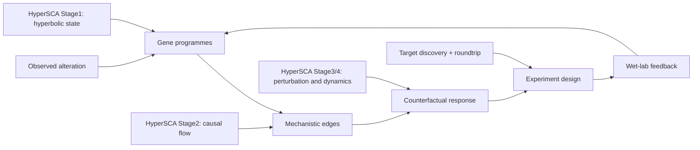

# HyperSCA 对照单细胞扰动方法生态的调研与改进路线

生成日期：2026-06-12
工作区：`E:\Codex_Projects\HyperSCA`

## 1. 调研范围与证据边界

本报告面向 HyperSCA 后续路线规划，围绕 Dimitrov、Schrod、Rohbeck 和 Stegle 的综述 *Interpretation, extrapolation and perturbation of single cells* 及其在线方法目录，系统对照单细胞扰动、外推和机制建模生态。调研采用以下来源：

- 在线综述资源：[ReadTheDocs 首页](https://interp-extrap-perturb.readthedocs.io/en/latest/index.html)
- 方法目录：[All Methods](https://interp-extrap-perturb.readthedocs.io/en/latest/methods.html)
- 论文 DOI：[https://doi.org/10.1038/s41576-025-00920-4](https://doi.org/10.1038/s41576-025-00920-4)
- 本地笔记：`G:\Downloads\Markdown笔记\Interpretation,extrapolation and perturbation of single cells.md`
- HyperSCA 当前状态源：`README.md`、`docs/project_inventory.md`、`src/` 当前源码
- 历史设计参考：`docs/technical_roadmap.md`，其中旧的“待实现/Skeleton”段落仅作历史上下文，不作为当前实现状态判定依据

证据解释采用保守口径：HyperSCA 的 in silico perturbation 结果应表述为机制假设、计算优先级或实验设计建议，不应表述为已经验证的治疗结论。

## 2. 综述 ontology：从 alteration 到 causal response

该综述将单细胞扰动方法组织成三类目标和五类建模概念。三类目标分别是：

- **Understand**：解释已经观测到的 alteration，例如差异表达、扰动响应、gene programmes、空间生态位变化、配体受体信号和调控结构。
- **Extrapolate**：预测未观测条件下的 response，例如未见细胞类型、患者、时间点、物种、单靶点、组合扰动和剂量条件下的反事实状态。
- **Guide**：用模型输出指导下一轮实验，例如选择靶点、组合、剂量、生态位、时间点和 readout，并用实验结果回写模型。

五类底层建模概念是 representation learning、causal inference、mechanistic discovery、disentanglement 和 population tracing。它们不是互斥分类，而是组合成不同方法族。例如 GEARS 结合 GNN 和基因先验用于未见/组合扰动，CellOT 用 optimal transport 做跨上下文响应映射，CausCell 将因果图与扩散生成结合，CellOracle、SCENIC+、LINGER 和 Dictys 更偏向 GRN 或机制发现。

## 3. 方法目录 crosswalk

ReadTheDocs 方法目录将 152+ 方法组织成 15 个 catalog task。下表按方法类别、代表方法族、HyperSCA 相关性和优先级归纳。详细矩阵见 `docs/research/interp_extrap_method_matrix.csv`。

| Catalog task | 代表方法与模型族 | 对 HyperSCA 的意义 | 优先级 |
|---|---|---|---|
| Causal Structure | NOTEARS、DAG-GNN、DCI、DCDI、Bicycle、Dictys、NODAGS-Flow、RiTINI、scCausalVI、SCCVAE、SEA | 直接对照 Stage2 因果图、PC/CI、bootstrap、DoWhy 语义边界 | P0 |
| GRN Inference | CellOracle、Dictys、LINGER、SCENIC+、RENGE、RiTINI、Geneformer、GeneCompass、scGPT、scPrint、scDoRI | 强化 LR-TF-target 机制证据，补足 RNA-only 因果图的调控解释 | P0 |
| Combinatorial Effect Prediction | GEARS、AttentionPert、CPA、MultiCPA、Biolord、CausCell、PDGrapher、Squidiff、State、scGPT | 对照 Step3/Step4 组合靶点、Bliss proxy 和反事实外推 | P0 |
| Unseen Perturbation Prediction | GEARS、ChemCPA、CODEX、PDGrapher、Squidiff、scGPT、scFoundation、GeneCompass、SCCVAE | 检验 HyperSCA 是否能泛化到未观测靶点或未观测组合 | P0 |
| Context Transfer | scGEN、trVAE、ChemCPA、CPA、CellOT、CondOT、CFGen、Prescient、scDiffusion、PDGrapher、Prophet | 支撑跨患者、跨平台、跨细胞类型和跨生态位迁移 | P1 |
| Perturbation Responsiveness | AUGUR、MELD、Mixscape、MUSIC、CINEMA-OT、CellOT、SCEPTRE、scDIST、Perturbation Score、scRANK | 为候选靶点引入响应强度、干预逃逸和 perturbation efficacy 审计 | P1 |
| Differential Analysis | CellDrift、scMAGeCK、Mixscale、Memento、Taichi、River、SCEPTRE、MiloDE、AUGUR、scDIST | 作为 descriptive alteration baseline，尤其适合负控、阳性对照和空间差异基线 | P1 |
| Feature Relationships | Hotspot、MISTy、SpaCeNet、Kasumi、Memento、Celcomen | 补充空间局部相关、邻域关系和分子 feature association，但不能直接当因果证据 | P1 |
| Linear Gene Programmes | MOFA+、MEFISTO、STAMP、cPCA、CSMF、GSFA、NicheCompass、Spectra、VEGA、scETM | 用于解释性 gene programme、niche programme 和先验可读模块 | P1 |
| Nonlinear Gene Programmes | scVI、Expimap、DRVI、ContrastiveVI、GeneCompass、scGPT、scFoundation、SIMVI、CellDISECT | 与 H-VAE 和 future foundation adapter 对照，强调非线性表示但需 baseline 审计 | P1 |
| Multi-component Disentanglement | CPA、ChemCPA、Biolord、CausCell、MultiCPA、SAMS-VAE、scCausalVI、SpatialDIVA、Spectra、TarDis | 对照 HyperSCA 的 z_int/z_ext 解缠，扩展 perturbation/context/component 分解 | P2 |
| Contrastive Disentanglement | cPCA、cVAE、cLVM、ContrastiveVI、ContrastiveVI+、MultiGroupVI、scINSIGHT、scDisInFact、scDSA | 用作 case-control、ICB response、platform contrast 的解释性辅助 | P2 |
| Unsupervised Disentanglement | MOFA+、MEFISTO、MuVi、DRVI、Decipher、CINEMA-OT、sparseVAE、SIMVI、STAMP | 可作为发现潜在混杂和未标注 variation 的诊断工具 | P2 |
| Seen Perturbation Prediction | Dr.VAE、CellBox、Prescient、scPreGan、scDisInFact、scELMo、trVAE、VCI、CausCell、SENA | 可作为已见扰动、剂量和时间插值 benchmark | P2 |
| Trace Cell Populations | Waddington-OT、CoSpar、CellOT、CondOT、moscot、MFM、MMFM、MioFlow、OT-CFM、SBALIGN、ARTEMIS | 补足“细胞群如何迁移”的分布层解释，适合中期新增 OT/flow sidecar | P2 |

## 4. HyperSCA 当前框架映射

### 4.1 Understand 层

当前 HyperSCA 已经覆盖数据标准化、空间图、TopoLa 增强、Lorentz/Poincare 双曲几何、H-VAE、cluster/cell 状态表征、因果图、信号流和生态位/多源证据组织。对应方法生态中的 representation learning、feature relationships、linear/nonlinear gene programmes、GRN inference 和 causal structure。

核心入口：

- `src/models/hyperbolic/`
- `src/data/spatial_graph.py`
- `src/causal/disentangle.py`
- `src/causal/cmi_pruning.py`
- `src/causal/causal_graph.py`
- `src/causal/signaling_flow.py`
- `src/discovery/target_discovery/`

### 4.2 Extrapolate 层

当前 HyperSCA 已覆盖 expression knockout、hyperbolic latent knockout、轻量 diffusion counterfactual、空间传播、时序传播、PK/PD 响应和组合干预。对应方法生态中的 context transfer、seen/unseen perturbation prediction、combinatorial effect prediction 和一部分 multi-component disentanglement。

关键边界：

- `expression_ko` 是稳健的代理 baseline，但机制表达力有限。
- `hyperbolic_latent_ko` 依赖 Step1 H-VAE artifact，适合与 scGen/CPA 类 latent perturbation 对照。
- `diffusion_cf` 是轻量反事实生成原型，不能等同于 CausCell 或 Squidiff 级别的完整扩散框架。
- Step4 的组合评分当前以 `bliss_proxy` 为主，应标注为组合优先级排序而非真实药效预测。

### 4.3 Guide 层

当前 HyperSCA 已覆盖候选池、多几何比较、证据评分、hub/组合保留、false-positive filtering、target discovery run manifest、roundtrip 校准和 Stage5 behavior grammar sidecar。对应综述中的 Guide future experiments。

重点机会是把 roundtrip 从“实验结果回来后校准”前移为“主动选择下一批实验”。这需要 active learning 或 experimental design 层，根据边不确定性、靶点多样性、生态位覆盖、成本和阳性/阴性对照生成可执行 panel。

## 5. 当前风险边界

1. **因果强度边界**
   Step2 的 PC/CI 结构可支持“因果候选边”或“机制假设边”，但在 gene-proxy 输入、未观测混杂、单细胞伪重复和空间共定位背景下，不能表述为已经证明的 causal mechanism。DoWhy 包装与已知轴评估应被写入证据等级，而不是当作完全证伪/证实。

2. **Step2 到 Step4 产物契约**
   需要检查 Step2 是否稳定导出 Step4 所需的 `cluster_expr_df.csv` 或等价 gene-name-preserving 表格。如果只有 `.npy` 矩阵而缺少基因名，Step4 目标解析和组合排序可能丢失语义。

3. **anchor-free 与 prior edge 的口径**
   当前候选基因不应预设 anchor，这是“候选池层面 anchor-free”。但 discovery causal wrapper 中如果注入 `PRIOR_AXES` 或使用 LR/TF-target 先验，应表述为“候选生成数据驱动，机制证据可吸收先验”，而不是整条 pipeline 完全无先验。

4. **Niche Ontology 仍偏 MVP**
   当前统一生态位更接近 fallback inventory 和 target mapping，不等同于跨平台、跨队列、跨分辨率稳定 ontology。后续应定义 ontology schema、label harmonization、平台特异标签和不确定性。

5. **复杂模型需 baseline 约束**
   综述明确提示复杂 generative/foundation models 并不总能超过简单线性或加性 baseline。HyperSCA 后续引入 scGPT、Geneformer、CellOT、GEARS 或 diffusion model 时，必须同时报告 simple mean、linear/additive、permutation/null baseline。

6. **文档状态冲突**
   `docs/technical_roadmap.md` 顶部与当前源码接近，但后文存在旧的“待实现/Skeleton”表格。短期应统一文档口径，避免报告、答辩或投稿材料中出现实现状态矛盾。

## 6. 可选改进方向

### 6.1 短期：0 到 3 个月

| 方向 | 预期收益 | 主要风险 | 最低可验证 MVP | 建议入口 |
|---|---|---|---|---|
| 单细胞扰动外推 benchmark | 明确 HyperSCA 与 GEARS、CellOT、CPA/scGen、linear baseline 在单靶点、组合靶点、未见靶点和未见状态上的差异 | 外部 Perturb-seq 与 CRC TME 生态差异大；复杂模型可能不优于简单基线 | 选 1 到 2 个公开 Perturb-seq 数据集，输出 PCC、DEG overlap、cell-state shift、unseen split 指标 | `src/evaluation/`，`src/perturbation/`，`scripts/benchmark_perturbation.py` |
| 因果图稳定性与负控审计 | 提升 causal structure 可信度，量化边的 bootstrap、平台、患者和生态位稳定性 | 可能暴露部分核心边不稳定 | 输出 `edge_stability.csv`、`negative_control_report.md`、`platform_consistency.json` | `src/causal/`，`src/evaluation/causal_metrics.py` |
| LR 到 TF 到 target 机制证据分解 | 将信号流从路径展示升级为分层机制证据 | curated prior 偏向已研究通路，细胞类型特异性不足 | 对 top 20 targets 输出 LR、TF、target、expression、spatial、niche 分解分数 | `src/causal/signaling_flow.py`，`src/discovery/target_discovery/scoring.py` |
| 空间通信 OT 对照 | 用 COMMOT 类 collective OT 或轻量距离约束流做空间通信基线 | OT 方向不等于因果方向，计算成本可能较高 | 在 Visium/CosMx 子集比较 3 到 5 条核心通路方向一致率 | `src/discovery/target_discovery/spatial.py`，`geometry.py` |
| 文档口径修复 | 消除 current implementation 与旧 roadmap 的状态冲突 | 可能牵涉较多历史描述 | 更新 `technical_roadmap.md` 中旧状态表，加“historical design”标注 | `docs/technical_roadmap.md` |

### 6.2 中期：3 到 9 个月

| 方向 | 预期收益 | 主要风险 | 最低可验证 MVP | 建议入口 |
|---|---|---|---|---|
| OT/flow population tracing | 解释 perturbation 或 ICB response 下细胞群从哪些 niche 迁移到哪些 niche | OT map 可能吸收 batch effect；需要 patient/block-aware coupling | 在 HyperSCA latent space 中构建 source niche 到 target niche 的流量矩阵和不确定性 | 新 `src/trajectory/` 或 `src/perturbation/temporal_spatial_propagation.py` |
| foundation model adapter | 借用 scGPT/Geneformer/CellFM 作为可选 cell/gene embedding prior，而不替换 H-VAE | 模型体积、版本、显存和 OOD 稳定性风险 | 比较 H-VAE only、FM only、H-VAE+FM prior 的 niche silhouette、causal stability、perturbation PCC | `src/models/`，`src/data/`，`src/evaluation/embedding_metrics.py` |
| active-learning 实验 panel | 将 roundtrip 前移为推荐下一批验证实验 | wet-lab 周期长，多轮 active learning 成本高 | 对 top 100 targets 生成 12/24/48 靶点 panel，给出覆盖度、不确定性下降和成本约束 | 新 `src/experimental_design/`，`src/pipeline/roundtrip_update.py` |
| 多模态 GRN 证据通道 | 用 ATAC motif、CITE protein、spatial colocalization 增强 GRN | 跨模态缺失和批次差异可能引入伪相关 | 有 ATAC/CITE 时为 TF-target/LR-target 边添加 optional support，不改变主模型 | `src/discovery/target_discovery/loaders.py`，`scoring.py` |
| Niche Ontology v1 | 从 fallback mapping 升级为跨平台生态位标签体系 | 不同平台分辨率差异大，统一标签可能过度合并 | 定义 niche schema、aliases、confidence、platform-specific labels 和 target-niche map | `src/discovery/target_discovery/niche.py` |

### 6.3 长期：9 到 18 个月以上

| 方向 | 预期收益 | 主要风险 | 最低可验证 MVP | 建议入口 |
|---|---|---|---|---|
| spatial perturbation schema | 直接消费空间扰动实验，而不是只从 ST 推断扰动传播 | 数据稀缺，guide assignment 和感染效率噪声高 | 定义 `perturbation_id`、`guide`、`cell_type`、`x_y`、`local_niche`、`expression`、`neighbor_context` schema，并跑一个公开数据子集 | `src/data/`，`src/perturbation/` |
| 机制约束 tissue digital twin | 统一双曲生态位、因果图、GRN、OT flow、PK/PD，用于组织状态转移模拟 | 极易过度复杂；没有足够扰动数据时只能是 hypothesis engine | 只在 3 到 5 个 niche 和 10 到 20 个核心基因/配体上做小型可校准模拟 | `src/pipeline/step4_dynamic_intervention.py`，新 `src/simulation/` |
| 前瞻性 wet-lab 闭环协议 | 将 HyperSCA 从分析框架推进到可执行发现闭环 | 需要真实实验资源，阴性结果可能多 | 选择 6 到 12 个单靶点、3 到 5 个组合，在 organoid、共培养或切片模型中验证转录响应和空间免疫 readout | `roundtrip_update.py`，`experimental_design/`，`reporting.py` |

## 7. 推荐执行顺序

1. **先做可信度底座**：perturbation benchmark、因果负控/稳定性、机制证据分解、文档状态修复。
2. **再做增强模块**：OT/flow population tracing、foundation model adapter、Niche Ontology v1。
3. **最后做实验闭环**：active-learning panel、spatial perturbation schema、wet-lab roundtrip protocol。

该顺序的理由是：短期任务能直接提高报告和论文可信度，且不会破坏现有 Step1 到 Step5 主干；中期任务作为 optional sidecar 或 adapter 加入；长期任务需要真实扰动数据和实验资源支撑。

## 8. 接受标准

- 15 个 catalog task 全部出现。
- 每个建议都包含收益、风险、MVP 和 HyperSCA 模块入口。
- 报告明确区分 descriptive alteration、mechanistic hypothesis、causal candidate 和 wet-lab validated effect。
- 不把 scGPT、Geneformer 或 CellFM 作为 H-VAE 替代品，只作为可选 adapter、prior 或 baseline。
- 不把 in silico target ranking 表述为治疗结论。

## 9. 参考链接

- Dimitrov D., Schrod S., Rohbeck M., Stegle O. *Interpretation, extrapolation and perturbation of single cells*. Nature Reviews Genetics, 2026. DOI: [10.1038/s41576-025-00920-4](https://doi.org/10.1038/s41576-025-00920-4); article page: [https://www.nature.com/articles/s41576-025-00920-4](https://www.nature.com/articles/s41576-025-00920-4)
- ReadTheDocs resource: [https://interp-extrap-perturb.readthedocs.io/en/latest/index.html](https://interp-extrap-perturb.readthedocs.io/en/latest/index.html)
- All Methods catalog: [https://interp-extrap-perturb.readthedocs.io/en/latest/methods.html](https://interp-extrap-perturb.readthedocs.io/en/latest/methods.html)
- Causal Structure task page: [https://interp-extrap-perturb.readthedocs.io/en/latest/causal_structure.html](https://interp-extrap-perturb.readthedocs.io/en/latest/causal_structure.html)
- GRN Inference task page: [https://interp-extrap-perturb.readthedocs.io/en/latest/grn_inference.html](https://interp-extrap-perturb.readthedocs.io/en/latest/grn_inference.html)
- Trace Cell Populations task page: [https://interp-extrap-perturb.readthedocs.io/en/latest/trace_cell_populations.html](https://interp-extrap-perturb.readthedocs.io/en/latest/trace_cell_populations.html)
- Unseen Perturbation Prediction task page: [https://interp-extrap-perturb.readthedocs.io/en/latest/unseen_perturbation_prediction.html](https://interp-extrap-perturb.readthedocs.io/en/latest/unseen_perturbation_prediction.html)
