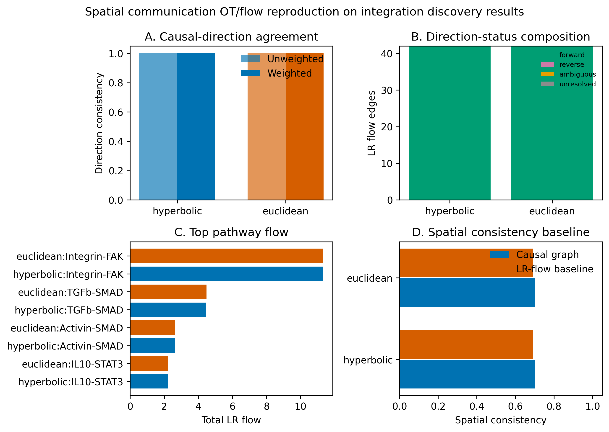

# Target Discovery 机制分解 Sidecar 与空间通信 OT/Flow 全量复现

## 1. 机制分解 sidecar 具体做了什么

新增的 `MechanismEvidenceStage` 插在 target discovery 的 `EvidenceScoringStage` 之后、`UnifiedNicheStage` 之前。它是 append-only sidecar：读取已经完成排序的 `target_ranking`，再读取 hyperbolic Step2 的 `flow_edges/flow_summary` 和 Step3 的 perturbation spatial metrics，生成解释性机制证据，不改变原有 `final_score`、`rank` 或候选池。

处理流程：

1. 从 Step2 `flow_edges` 中按同一 `pathway + causal_edge` 拼接三段链路：Ligand→Receptor、Receptor→TF、TF→Target。
2. 对排序靠前候选逐一匹配：候选基因只要出现在 ligand、receptor、TF 或 downstream target 任一位置，就生成一条机制证据行。
3. 为每条链路拆解证据列：`s_lr_prior`、`s_expr_ligand`、`s_expr_receptor`、`s_expr_tf`、`s_expr_target`、`s_causal_edge`、`s_tf_target_prior`、`s_spatial`、`s_niche`。
4. 汇总为解释性 `s_mechanism`，权重为 LR prior 0.20、表达完整性 0.25、因果边权 0.25、TF-target prior 0.15、空间支持 0.10、生态位支持 0.05。
5. 输出 `mechanism_evidence_matrix.csv`、`target_ranking_with_mechanism.csv`、`mechanism_summary.json`、`mechanism_evidence_report.md`。

边界：`s_mechanism` 是解释列，不并入 `final_score`；LR/TF-target prior 只解释已由数据驱动层提名的候选，不注入候选池，不构成治疗有效性结论。

## 2. 空间通信 OT/Flow 全量复现

本次复现使用当前实现的 distance-constrained LR communication OT/flow proxy，不是完整 COMMOT。输入为 `results/integration/discovery/{hyperbolic,euclidean}` 的预计算结果；旧 integration 目录没有单独持久化 `spatial_adjacency.npy`，因此采用 `geometry/blended.npy` 作为空间-几何约束兼容输入。

复现命令：

```powershell
python scripts\reproduce_spatial_communication_ot.py
```

复现输出目录：`results/integration/discovery/communication_ot_reproduction/`

每个 mode 均生成：

- `lr_flow_edges.csv`
- `flow_matrix.npy`
- `pathway_summary.csv`
- `direction_consistency.json`
- `baseline_comparison.json`

汇总文件：

- `mode_summary.csv`
- `pathway_summary_all_modes.csv`
- `top_lr_flow_edges_all_modes.csv`
- `spatial_communication_ot_reproduction_report.md`
- `spatial_communication_ot_reproduction.png`
- `manifest.json`



## 3. 复现结果摘要

| mode       |   n_nodes |   n_lr_flow_edges |   resolved_edges |   forward_count |   reverse_count |   ambiguous_count |   unresolved_count |   direction_consistency_rate |   weighted_direction_consistency_rate |   total_flow |   max_flow |   causal_spatial_consistency |   baseline_spatial_consistency |   spatial_consistency_gain | spatial_source   |
|:-----------|----------:|------------------:|-----------------:|----------------:|----------------:|------------------:|-------------------:|-----------------------------:|--------------------------------------:|-------------:|-----------:|-----------------------------:|-------------------------------:|---------------------------:|:-----------------|
| hyperbolic |        20 |                42 |               42 |              42 |               0 |                 0 |                  0 |                            1 |                                     1 |      20.6741 |   0.632228 |                     0.702128 |                       0.692308 |                 0.00981997 | blended          |
| euclidean  |        20 |                42 |               42 |              42 |               0 |                 0 |                  0 |                            1 |                                     1 |      20.6879 |   0.631806 |                     0.702128 |                       0.692308 |                 0.00981997 | blended          |

## 4. 通路层结果

| mode       | pathway      |   n_edges |   total_flow |   mean_flow |   max_flow | top_source         | top_target         |   causal_forward_count |   causal_reverse_count |   ambiguous_count |   unresolved_count |   direction_consistency_rate |
|:-----------|:-------------|----------:|-------------:|------------:|-----------:|:-------------------|:-------------------|-----------------------:|-----------------------:|------------------:|-------------------:|-----------------------------:|
| euclidean  | Integrin-FAK |        24 |     11.3192  |    0.471632 |   0.608643 | Fibroblast_S1      | Macrophage_cycling |                     24 |                      0 |                 0 |                  0 |                            1 |
| euclidean  | TGFb-SMAD    |         8 |      4.47709 |    0.559636 |   0.631806 | Macrophage_cycling | T_cell_CD8_cycling |                      8 |                      0 |                 0 |                  0 |                            1 |
| euclidean  | Activin-SMAD |         6 |      2.65305 |    0.442175 |   0.522332 | Fibroblast_S1      | T_cell_regulatory  |                      6 |                      0 |                 0 |                  0 |                            1 |
| euclidean  | IL10-STAT3   |         4 |      2.23855 |    0.559636 |   0.631806 | Macrophage_cycling | T_cell_CD8_cycling |                      4 |                      0 |                 0 |                  0 |                            1 |
| hyperbolic | Integrin-FAK |        24 |     11.3101  |    0.471256 |   0.609111 | Fibroblast_S1      | Macrophage_cycling |                     24 |                      0 |                 0 |                  0 |                            1 |
| hyperbolic | TGFb-SMAD    |         8 |      4.47486 |    0.559358 |   0.632228 | Macrophage_cycling | T_cell_CD8_cycling |                      8 |                      0 |                 0 |                  0 |                            1 |
| hyperbolic | Activin-SMAD |         6 |      2.6517  |    0.441949 |   0.523556 | Fibroblast_S1      | T_cell_regulatory  |                      6 |                      0 |                 0 |                  0 |                            1 |
| hyperbolic | IL10-STAT3   |         4 |      2.23743 |    0.559358 |   0.632228 | Macrophage_cycling | T_cell_CD8_cycling |                      4 |                      0 |                 0 |                  0 |                            1 |

## 5. Top LR flow edges（前 20）

| mode       |   rank_in_mode | pathway      | source_node        | target_node        | ligand   | receptor   | tf    | target_gene   |   flow_score | direction_status   | missing_genes   |
|:-----------|---------------:|:-------------|:-------------------|:-------------------|:---------|:-----------|:------|:--------------|-------------:|:-------------------|:----------------|
| hyperbolic |              1 | TGFb-SMAD    | Macrophage_cycling | T_cell_CD8_cycling | TGFB1    | TGFBR2     | SMAD2 | LAG3          |     0.632228 | forward            |                 |
| hyperbolic |              2 | TGFb-SMAD    | Macrophage_cycling | T_cell_CD8_cycling | TGFB1    | TGFBR1     | SMAD3 | HAVCR2        |     0.632228 | forward            |                 |
| hyperbolic |              3 | IL10-STAT3   | Macrophage_cycling | T_cell_CD8_cycling | IL10     | IL10RA     | STAT3 | PDCD1         |     0.632228 | forward            |                 |
| hyperbolic |              4 | Integrin-FAK | Fibroblast_S1      | Macrophage_cycling | MFAP2    | ITGA5      | SRC   | CD163         |     0.609111 | forward            |                 |
| hyperbolic |              5 | Integrin-FAK | Fibroblast_S1      | Macrophage_cycling | POSTN    | ITGAV      | SRC   | CD163         |     0.609111 | forward            |                 |
| hyperbolic |              6 | IL10-STAT3   | Macrophage         | T_cell_CD8_cycling | IL10     | IL10RA     | STAT3 | PDCD1         |     0.602099 | forward            |                 |
| hyperbolic |              7 | TGFb-SMAD    | Macrophage         | T_cell_CD8_cycling | TGFB1    | TGFBR1     | SMAD3 | HAVCR2        |     0.602099 | forward            |                 |
| hyperbolic |              8 | TGFb-SMAD    | Macrophage         | T_cell_CD8_cycling | TGFB1    | TGFBR2     | SMAD2 | LAG3          |     0.602099 | forward            |                 |
| hyperbolic |              9 | IL10-STAT3   | Macrophage         | T_cell_CD8         | IL10     | IL10RA     | STAT3 | PDCD1         |     0.564575 | forward            |                 |
| hyperbolic |             10 | TGFb-SMAD    | Macrophage         | T_cell_CD8         | TGFB1    | TGFBR2     | SMAD2 | LAG3          |     0.564575 | forward            |                 |
| hyperbolic |             11 | TGFb-SMAD    | Macrophage         | T_cell_CD8         | TGFB1    | TGFBR1     | SMAD3 | HAVCR2        |     0.564575 | forward            |                 |
| hyperbolic |             12 | Integrin-FAK | Fibroblast_S1      | Macrophage         | POSTN    | ITGAV      | SRC   | CD163         |     0.552911 | forward            |                 |
| hyperbolic |             13 | Integrin-FAK | Fibroblast_S1      | Macrophage         | MFAP2    | ITGA5      | SRC   | CD163         |     0.552911 | forward            |                 |
| hyperbolic |             14 | Integrin-FAK | Fibroblast_S3      | Macrophage         | MFAP2    | ITGA5      | SRC   | CD163         |     0.533514 | forward            |                 |
| hyperbolic |             15 | Integrin-FAK | Fibroblast_S3      | Macrophage         | POSTN    | ITGAV      | SRC   | CD163         |     0.533514 | forward            |                 |
| hyperbolic |             16 | Integrin-FAK | Fibroblast_S2      | Macrophage         | MFAP2    | ITGA5      | SRC   | CD163         |     0.526435 | forward            |                 |
| hyperbolic |             17 | Integrin-FAK | Fibroblast_S2      | Macrophage         | POSTN    | ITGAV      | SRC   | CD163         |     0.526435 | forward            |                 |
| hyperbolic |             18 | Activin-SMAD | Fibroblast_S1      | T_cell_regulatory  | INHBA    | ACVR2A     | SMAD3 | FOXP3         |     0.523556 | forward            |                 |
| hyperbolic |             19 | Integrin-FAK | Fibroblast_S2      | Macrophage_cycling | MFAP2    | ITGA5      | SRC   | CD163         |     0.518156 | forward            |                 |
| hyperbolic |             20 | Integrin-FAK | Fibroblast_S2      | Macrophage_cycling | POSTN    | ITGAV      | SRC   | CD163         |     0.518156 | forward            |                 |

## 6. 解释边界

- 方向一致率 1.0 表示这些 LR flow proxy 边在当前因果图方向上全部为 forward；这不是因果证明。
- Hyperbolic 和 Euclidean 的 pathway total flow 很接近，说明这批 20 个 cluster 的 LR-prior flow 对几何模式不敏感；差异主要来自 geometry distance/blended adjacency 的微小权重变化。
- `causal_spatial_consistency` 与 `baseline_spatial_consistency` 均在 0-1 区间；当前复现中因果图空间一致性约为 0.702，LR-flow baseline 约为 0.692。
- 当前复现为 cluster-level、prior-guided、distance-constrained flow；如需严格 COMMOT，需要 spot/cell-level 表达、空间坐标、mass/cost schema 和 COMMOT 依赖版本锁定。

## 7. Manifest

- Source dir: `E:\Codex_Projects\HyperSCA\results\integration\discovery`
- Spatial source: `blended`
- Alpha/Beta/Epsilon: `0.5` / `0.5` / `1.0`
- Warnings: `[]`
