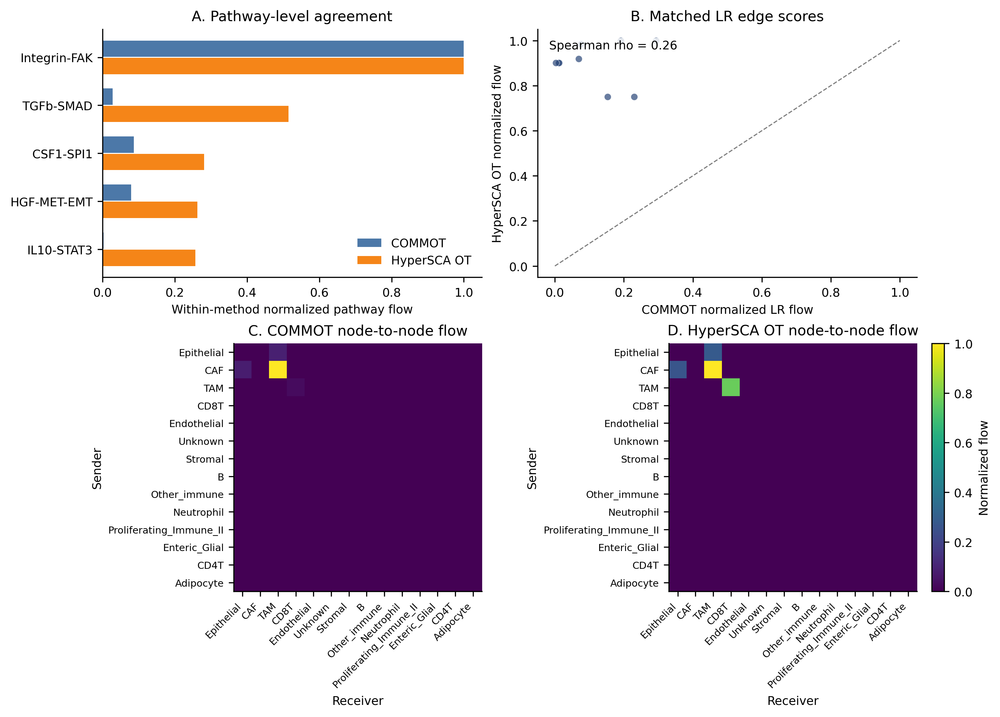

# VisiumHD 8um COMMOT 与 HyperSCA OT-flow 对比

## 运行边界

- 输入矩阵：`E:\Codex_Projects\HyperSCA\data\VisiumHD_HumanColon_Oliveira\binned_outputs\square_008um\filtered_feature_bc_matrix.h5`，shape 为 `18,085 genes × 545,913 barcodes`。
- 本轮使用全部 8um expression barcodes 聚合 cell-type nodes；空间约束由全部可定位 bins 的 kNN 接触图估计。
- COMMOT 原始 bin 级全量运行不可直接执行：其公开接口需要 `n_obs × n_obs` 距离矩阵，`545,913 × 545,913` dense 距离矩阵单项即超过 TB 级内存。
- 因此，本报告中的“全量复现”指：全量 bins 参与表达聚合与空间接触统计，COMMOT 和 HyperSCA OT-flow 在同一 cell-type 聚合图上对照。

## 数据规模

| 指标 | 数值 |
|---|---:|
| expression bins | 545,913 |
| 聚合 nodes | 14 |
| CRC LR/TF/target 基因命中 | 31 |
| 缺失基因 | 1 |
| COMMOT expected LR edges | 9 |
| HyperSCA OT edges | 9 |
| paired Spearman rho | 0.256 |
| paired Pearson r | -0.021 |
| elapsed seconds | 22.0 |

## Cell-type nodes

| node                    |   n_bins |
|:------------------------|---------:|
| Epithelial              |   257291 |
| CAF                     |    78018 |
| TAM                     |    24321 |
| CD8T                    |     2447 |
| Endothelial             |    19978 |
| Unknown                 |   114909 |
| Stromal                 |    21754 |
| B                       |    12308 |
| Other_immune            |     1736 |
| Neutrophil              |     4647 |
| Proliferating_Immune_II |     3660 |
| Enteric_Glial           |      857 |
| CD4T                    |     3711 |
| Adipocyte               |      276 |

## Pathway comparison

COMMOT pathway summary:

| pathway      |   n_edges |   total_score |   mean_score |   max_score |   mean_normalized | top_edge                  |
|:-------------|----------:|--------------:|-------------:|------------:|------------------:|:--------------------------|
| Integrin-FAK |         4 |   0.0698218   |  0.0174555   | 0.023641    |         0.112808  | CAF→TAM:POSTN-ITGAV       |
| CSF1-SPI1    |         1 |   0.0060814   |  0.0060814   | 0.0060814   |         0.0704845 | Epithelial→TAM:CSF1-CSF1R |
| HGF-MET-EMT  |         1 |   0.00555739  |  0.00555739  | 0.00555739  |         0.301976  | CAF→Epithelial:HGF-MET    |
| TGFb-SMAD    |         2 |   0.00197004  |  0.000985022 | 0.00100833  |         0.0131564 | TAM→CD8T:TGFB1-TGFBR2     |
| IL10-STAT3   |         1 |   0.000192165 |  0.000192165 | 0.000192165 |         0.0178127 | TAM→CD8T:IL10-IL10RA      |

HyperSCA OT-flow pathway summary:

| pathway      |   n_edges |   total_flow |   mean_flow |   max_flow | top_source   | top_target   |   causal_forward_count |   causal_reverse_count |   ambiguous_count |   unresolved_count |   direction_consistency_rate |
|:-------------|----------:|-------------:|------------:|-----------:|:-------------|:-------------|-----------------------:|-----------------------:|------------------:|-------------------:|-----------------------------:|
| CSF1-SPI1    |         1 |     0.558726 |    0.558726 |   0.558726 | Epithelial   | TAM          |                      0 |                      0 |                 0 |                  1 |                            0 |
| HGF-MET-EMT  |         1 |     0.521229 |    0.521229 |   0.521229 | CAF          | Epithelial   |                      0 |                      0 |                 0 |                  1 |                            0 |
| IL10-STAT3   |         1 |     0.510965 |    0.510965 |   0.510965 | TAM          | CD8T         |                      0 |                      0 |                 0 |                  1 |                            0 |
| Integrin-FAK |         4 |     1.98588  |    0.496469 |   0.567393 | CAF          | TAM          |                      0 |                      0 |                 0 |                  4 |                            0 |
| TGFb-SMAD    |         2 |     1.02193  |    0.510965 |   0.510965 | TAM          | CD8T         |                      0 |                      0 |                 0 |                  2 |                            0 |

## Paired LR edge comparison

| pathway      | ligand   | receptor   | source_node   | target_node   |   commot_global_normalized |   normalized_flow |
|:-------------|:---------|:-----------|:--------------|:--------------|---------------------------:|------------------:|
| Integrin-FAK | POSTN    | ITGAV      | CAF           | TAM           |                 0.293486   |          1        |
| Integrin-FAK | MFAP2    | ITGA5      | CAF           | TAM           |                 0.191199   |          1        |
| CSF1-SPI1    | CSF1     | CSF1R      | Epithelial    | TAM           |                 0.0754962  |          0.984724 |
| HGF-MET-EMT  | HGF      | MET        | CAF           | Epithelial    |                 0.0689911  |          0.918639 |
| TGFb-SMAD    | TGFB1    | TGFBR2     | TAM           | CD8T          |                 0.0125177  |          0.900549 |
| TGFb-SMAD    | TGFB1    | TGFBR1     | TAM           | CD8T          |                 0.0119389  |          0.900549 |
| IL10-STAT3   | IL10     | IL10RA     | TAM           | CD8T          |                 0.00238559 |          0.900549 |
| Integrin-FAK | POSTN    | ITGB5      | CAF           | TAM           |                 0.229743   |          0.75     |
| Integrin-FAK | MFAP2    | ITGB1      | CAF           | TAM           |                 0.15236    |          0.75     |

## Figure

## 输出文件

- `E:\Codex_Projects\HyperSCA\results\visiumhd8um_commot_ot_comparison\input_manifest.json`
- `E:\Codex_Projects\HyperSCA\results\visiumhd8um_commot_ot_comparison\selected_gene_expression_by_node.csv`
- `E:\Codex_Projects\HyperSCA\results\visiumhd8um_commot_ot_comparison\spatial_contact_adjacency.csv`
- `E:\Codex_Projects\HyperSCA\results\visiumhd8um_commot_ot_comparison\commot\commot_crc_expected_edges.csv`
- `E:\Codex_Projects\HyperSCA\results\visiumhd8um_commot_ot_comparison\hypersca_ot\lr_flow_edges.csv`
- `E:\Codex_Projects\HyperSCA\results\visiumhd8um_commot_ot_comparison\comparison\paired_lr_edge_comparison.csv`
- `E:\Codex_Projects\HyperSCA\results\visiumhd8um_commot_ot_comparison\comparison\method_summary.csv`

## 解释口径

本结果是空间通信与机制假设的计算对照，不是因果证明或治疗结论。COMMOT 分数反映基于表达与空间代价的 collective optimal transport 通信强度；HyperSCA OT-flow 分数反映 LR 先验、表达支持、空间接触和几何距离约束下的轻量 sidecar 对照。
